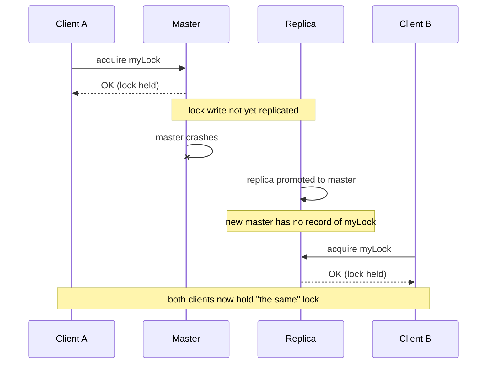

## Choosing a lock

Redisson offers several distributed lock types. They share the same `RLock`-style API and watchdog behavior, and differ mainly in ordering guarantees, whether they hand out a fencing token, and how a waiting thread is notified. The table below summarizes the trade-offs; each type is documented in its own section further down.

| Lock type | Reentrant | Fair / FIFO | Fencing token | Waiting mechanism | Typical use case |
| --- | --- | --- | --- | --- | --- |
| [Lock](#lock) | ✔️ | ❌ | ❌ | Pub/sub | General mutual exclusion |
| [Non-Reentrant Lock](#non-reentrant-lock) | ❌ | ❌ | ❌ | Pub/sub | Mutual exclusion where the same thread must not re-enter |
| [Fair Lock](#fair-lock) | ✔️ | ✔️ | ❌ | Pub/sub | Acquisition must follow request order (FIFO) |
| [Non-Reentrant Fair Lock](#non-reentrant-fair-lock) | ❌ | ✔️ | ❌ | Pub/sub | FIFO ordering without reentrancy |
| [MultiLock](#multilock) | ✔️ | ❌ | ❌ | Pub/sub | Lock several keys together as a single unit |
| [ReadWriteLock](#readwritelock) | ✔️ | ❌ | ❌ | Pub/sub | Many concurrent readers, one exclusive writer |
| [Spin Lock](#spin-lock) | ✔️ | ❌ | ❌ | Backoff polling | Very large numbers of locks, where one pub/sub subscription per lock is too costly |
| [Fenced Lock](#fenced-lock) | ✔️ | ❌ | ✔️ | Pub/sub | Guarding an external resource against a stale lock holder |

## Lock reliability and fencing

Redisson's distributed locks are built on Valkey or Redis and are *advisory*: they coordinate only the clients that acquire the same lock object, and their safety depends on the deployment topology. The subsections below walk through the failover hazard that arises when a lock is returned before it has replicated, how Redisson's replica-synchronization check — on by default — closes it, and the residual risk that fencing tokens address.

### The failover hazard

Acquiring an `RLock` writes the lock entry to the master. A naive distributed lock returns to the caller as soon as the master accepts that write — before it has reached any replica. If the master then fails over to a replica that has not yet received the write, the new master has no record of the lock and a second client can acquire it, leaving two clients that each believe they hold the same lock. The sequence below shows this hazard with the synced-slaves check disabled:



Redisson closes this window by default, as the next subsection describes, so `RLock` does not rely on the application to avoid it.

### Checking replica synchronization

Redisson can verify after each acquisition that the lock has propagated to the connected replicas. Two `Config` settings control this:

* `checkLockSyncedSlaves` — whether to confirm, after acquisition, that the lock reached the connected replicas. Enabled by default.
* `slavesSyncTimeout` — how long to wait for that synchronization, in milliseconds (default `1000`). The same timeout applies to `RLock`, `RSemaphore`, and `RPermitExpirableSemaphore`.

```java
Config config = new Config();
config.setCheckLockSyncedSlaves(true)   // default
      .setSlavesSyncTimeout(1000);       // milliseconds, default
```

With checking enabled, Redisson waits after acquisition for the lock to reach the replicas. If the required replicas do not acknowledge within `slavesSyncTimeout`, Redisson releases the lock and the acquisition fails, so a client never keeps a lock that was not safely replicated and could later be lost to a failover.

### Fencing tokens with RFencedLock

A fencing token turns "I think I hold the lock" into something the protected resource can verify. [RFencedLock](#fenced-lock) returns a monotonically increasing token on each acquisition; the resource records the highest token it has seen and rejects any operation that carries a lower one. A client that paused and then resumes with a stale token is fenced out, even though it still believes it holds the lock.

```java
RFencedLock lock = redisson.getFencedLock("myLock");

// acquire the lock and obtain a monotonically increasing fencing token
Long token = lock.lockAndGetToken();
try {
    // pass the token to the protected resource, which must reject any write
    // whose token is lower than the highest it has already accepted
    storage.write(data, token);
} finally {
    lock.unlock();
}
```

`getToken()` returns the current token without acquiring, and `tryLockAndGetToken()` returns `null` when the lock is not acquired. Reach for a fenced lock whenever the lock guards writes to an external system that can enforce the token; for purely in-process coordination a plain [RLock](#lock) is enough.

## Lock
Valkey or Redis based distributed reentrant [Lock](https://static.javadoc.io/org.redisson/redisson/latest/org/redisson/api/RLock.html) object for Java and implements [Lock](https://docs.oracle.com/javase/8/docs/api/java/util/concurrent/locks/Lock.html) interface. Uses pub/sub channel to notify other threads across all Redisson instances waiting to acquire a lock.

If Redisson instance which acquired lock crashes then such lock could hang forever in acquired state. To avoid this Redisson maintains lock watchdog, it prolongs lock expiration while lock holder Redisson instance is alive. By default lock watchdog timeout is 30 seconds and can be changed through [Config.lockWatchdogTimeout](../configuration.md) setting.  

`leaseTime` parameter during lock acquisition can be defined. After specified time interval locked lock will be released automatically.

`RLock` object behaves according to the Java Lock specification. It means only lock owner thread can unlock it otherwise `IllegalMonitorStateException` would be thrown. Otherwise consider to use [RSemaphore](#semaphore) object.

!!! note
    In the asynchronous, reactive, and RxJava3 APIs a single logical operation may run across more than one thread, so the thread that acquires a lock may not be the one that releases it. Because lock ownership is tied to a thread id, pin it explicitly: capture `Thread.currentThread().getId()` and pass the same `threadId` to the `lock`, `tryLock`, and `unlock` calls, as shown in the Reactive and RxJava3 examples below.

Code examples:

=== "Sync"
    ```
    RLock lock = redisson.getLock("myLock");

    // traditional lock method
    lock.lock();

    // or acquire lock and automatically unlock it after 10 seconds
    lock.lock(10, TimeUnit.SECONDS);

    // or wait for lock acquisition up to 100 seconds and auto-unlock after 10 seconds
    boolean res = lock.tryLock(100, 10, TimeUnit.SECONDS);
    if (res) {
        try {
            // ...
        } finally {
            lock.unlock();
        }
    }
    ```
=== "Async"
    ```
    RLock lock = redisson.getLock("myLock");

    RFuture<Void> lockFuture = lock.lockAsync();

    // or acquire lock and automatically unlock it after 10 seconds
    RFuture<Void> lockFuture = lock.lockAsync(10, TimeUnit.SECONDS);

    // or wait for lock acquisition up to 100 seconds and auto-unlock after 10 seconds
    RFuture<Boolean> lockFuture = lock.tryLockAsync(100, 10, TimeUnit.SECONDS);

    lockFuture.whenComplete((res, exception) -> {
        // ...
        lock.unlockAsync();
    });
    ```
=== "Reactive"
    ```
    RedissonReactiveClient redisson = redissonClient.reactive();
    RLockReactive lock = redisson.getLock("myLock");

    long threadId = Thread.currentThread().getId();
    Mono<Void> lockMono = lock.lock(threadId);

    // or acquire lock and automatically unlock it after 10 seconds
    Mono<Void> lockMono = lock.lock(10, TimeUnit.SECONDS, threadId);

    // or wait for lock acquisition up to 100 seconds and auto-unlock after 10 seconds
    Mono<Boolean> lockMono = lock.tryLock(100, 10, TimeUnit.SECONDS, threadId);

    lockMono.doOnNext(res -> {
        // ...
    })
    .doFinally(signalType -> lock.unlock(threadId).subscribe())
    .subscribe();
    ```
=== "RxJava3"
    ```
    RedissonRxClient redisson = redissonClient.rxJava();
    RLockRx lock = redisson.getLock("myLock");

    long threadId = Thread.currentThread().getId();
    Completable lockRes = lock.lock(threadId);

    // or acquire lock and automatically unlock it after 10 seconds
    Completable lockRes = lock.lock(10, TimeUnit.SECONDS, threadId);

    // or wait for lock acquisition up to 100 seconds and auto-unlock after 10 seconds
    Single<Boolean> lockRes = lock.tryLock(100, 10, TimeUnit.SECONDS, threadId);

    lockRes.doOnSuccess(res -> {
        // ...
    })
    .doFinally(() -> lock.unlock(threadId).subscribe())
    .subscribe();
    ```

## Non-Reentrant Lock
Valkey or Redis based distributed non-reentrant [Lock](https://static.javadoc.io/org.redisson/redisson/latest/org/redisson/api/RLock.html) object for Java and implements [Lock](https://docs.oracle.com/javase/8/docs/api/java/util/concurrent/locks/Lock.html) interface.

Unlike the regular [Lock](#lock), a thread that already holds the lock cannot acquire it again. Any attempt to re-acquire from the same thread &mdash; whether via `lock()`, `tryLock()`, or `tryLock(waitTime, unit)` &mdash; throws `IllegalMonitorStateException` immediately. This is useful for catching programmer errors in code paths that should never be reentered while the lock is held. Other threads contend for the lock as usual.

If Redisson instance which acquired lock crashes then such lock could hang forever in acquired state. To avoid this Redisson maintains lock watchdog, it prolongs lock expiration while lock holder Redisson instance is alive. By default lock watchdog timeout is 30 seconds and can be changed through [Config.lockWatchdogTimeout](../configuration.md) setting.

`leaseTime` parameter during lock acquisition can be defined. After specified time interval locked lock will be released automatically.

Only the lock owner thread can unlock the lock; otherwise `IllegalMonitorStateException` is thrown &mdash; the same as for the regular [Lock](#lock).

Code examples:

=== "Sync"
    ```
    RLock lock = redisson.getNonReentrantLock("myLock");

    // traditional lock method
    lock.lock();

    // a second acquire from the same thread throws IllegalMonitorStateException
    // lock.lock();

    // or acquire lock and automatically unlock it after 10 seconds
    lock.lock(10, TimeUnit.SECONDS);

    // or wait for lock acquisition up to 100 seconds
    // and automatically unlock it after 10 seconds
    boolean res = lock.tryLock(100, 10, TimeUnit.SECONDS);
    if (res) {
       try {
         ...
       } finally {
           lock.unlock();
       }
    }
    ```
=== "Async"
    ```
    RLock lock = redisson.getNonReentrantLock("myLock");

    RFuture<Void> lockFuture = lock.lockAsync();

    // or acquire lock and automatically unlock it after 10 seconds
    RFuture<Void> lockFuture = lock.lockAsync(10, TimeUnit.SECONDS);

    // or wait for lock acquisition up to 100 seconds
    // and automatically unlock it after 10 seconds
    RFuture<Boolean> lockFuture = lock.tryLockAsync(100, 10, TimeUnit.SECONDS);

    lockFuture.whenComplete((res, exception) -> {
        // exception is IllegalMonitorStateException (wrapped in CompletionException)
        // if the calling thread already holds this lock
        // ...
        lock.unlockAsync();
    });
    ```
=== "Reactive"
    ```
    RedissonReactiveClient redisson = redissonClient.reactive();
    RLockReactive lock = redisson.getNonReentrantLock("myLock");

    Mono<Void> lockMono = lock.lock();

    // or acquire lock and automatically unlock it after 10 seconds
    Mono<Void> lockMono = lock.lock(10, TimeUnit.SECONDS);

    // or wait for lock acquisition up to 100 seconds
    // and automatically unlock it after 10 seconds
    Mono<Boolean> lockMono = lock.tryLock(100, 10, TimeUnit.SECONDS);

    lockMono.doOnNext(res -> {
        // ...
    })
    .doFinally(signalType -> lock.unlock().subscribe())
    .subscribe();
    ```
=== "RxJava3"
    ```
    RedissonRxClient redisson = redissonClient.rxJava();
    RLockRx lock = redisson.getNonReentrantLock("myLock");

    Completable lockRes = lock.lock();

    // or acquire lock and automatically unlock it after 10 seconds
    Completable lockRes = lock.lock(10, TimeUnit.SECONDS);

    // or wait for lock acquisition up to 100 seconds
    // and automatically unlock it after 10 seconds
    Single<Boolean> lockRes = lock.tryLock(100, 10, TimeUnit.SECONDS);

    lockRes.doOnSuccess(res -> {
        // ...
    })
    .doFinally(() -> lock.unlock().subscribe())
    .subscribe();
    ```

## Fair Lock
Valkey or Redis based distributed reentrant fair [Lock](https://static.javadoc.io/org.redisson/redisson/latest/org/redisson/api/RLock.html) object for Java implements [Lock](https://docs.oracle.com/javase/8/docs/api/java/util/concurrent/locks/Lock.html) interface. 

Fair lock guarantees that threads will acquire it in is same order they requested it. All waiting threads are queued and if some thread has died then Redisson waits its return for 5 seconds. For example, if 5 threads are died for some reason then delay will be 25 seconds.

If Redisson instance which acquired lock crashes then such lock could hang forever in acquired state. To avoid this Redisson maintains lock watchdog, it prolongs lock expiration while lock holder Redisson instance is alive. By default lock watchdog timeout is 30 seconds and can be changed through [Config.lockWatchdogTimeout](../configuration.md) setting.  

`leaseTime` parameter during lock acquisition can be defined. After specified time interval locked lock will be released automatically.

`RLock` object behaves according to the Java Lock specification. It means only lock owner thread can unlock it otherwise `IllegalMonitorStateException` would be thrown. Otherwise consider to use [RSemaphore](#semaphore) object.

Code examples:

=== "Sync"
    ```
    RLock lock = redisson.getFairLock("myLock");

    // traditional lock method
    lock.lock();

    // or acquire lock and automatically unlock it after 10 seconds
    lock.lock(10, TimeUnit.SECONDS);

    // or wait for lock acquisition up to 100 seconds 
    // and automatically unlock it after 10 seconds
    boolean res = lock.tryLock(100, 10, TimeUnit.SECONDS);
    if (res) {
       try {
         ...
       } finally {
           lock.unlock();
       }
    }
    ```
=== "Async"
    ```
    RLock lock = redisson.getFairLock("myLock");

    RFuture<Void> lockFuture = lock.lockAsync();

    // or acquire lock and automatically unlock it after 10 seconds
    RFuture<Void> lockFuture = lock.lockAsync(10, TimeUnit.SECONDS);

    // or wait for lock acquisition up to 100 seconds 
    // and automatically unlock it after 10 seconds
    RFuture<Boolean> lockFuture = lock.tryLockAsync(100, 10, TimeUnit.SECONDS);

    lockFuture.whenComplete((res, exception) -> {
        // ...
        lock.unlockAsync();
    });
    ```
=== "Reactive"
    ```
    RedissonReactiveClient redisson = redissonClient.reactive();
    RLockReactive lock = redisson.getFairLock("myLock");

    long threadId = Thread.currentThread().getId();
    Mono<Void> lockMono = lock.lock(threadId);

    // or acquire lock and automatically unlock it after 10 seconds
    Mono<Void> lockMono = lock.lock(10, TimeUnit.SECONDS, threadId);

    // or wait for lock acquisition up to 100 seconds 
    // and automatically unlock it after 10 seconds
    Mono<Boolean> lockMono = lock.tryLock(100, 10, TimeUnit.SECONDS, threadId);

    lockMono.doOnSuccess(res -> {
       // ...
    })
    .doFinally(r -> lock.unlock(threadId).subscribe())
    .subscribe();
    ```
=== "RxJava3"
    ```
    RedissonRxClient redisson = redissonClient.rxJava();
    RLockRx lock = redisson.getFairLock("myLock");

    long threadId = Thread.currentThread().getId();
    Completable lockRes = lock.lock(threadId);

    // or acquire lock and automatically unlock it after 10 seconds
    Completable lockRes = lock.lock(10, TimeUnit.SECONDS, threadId);

    // or wait for lock acquisition up to 100 seconds 
    // and automatically unlock it after 10 seconds
    Single<Boolean> lockRes = lock.tryLock(100, 10, TimeUnit.SECONDS, threadId);

    lockRes.doOnSuccess(res -> {
       // ...
    })
    .doFinally(() -> lock.unlock(threadId).subscribe())
    .subscribe();
    ```

## Non-Reentrant Fair Lock
Valkey or Redis based distributed non-reentrant fair [Lock](https://static.javadoc.io/org.redisson/redisson/latest/org/redisson/api/RLock.html) object for Java implements [Lock](https://docs.oracle.com/javase/8/docs/api/java/util/concurrent/locks/Lock.html) interface.

Acquisition order is FIFO across all Redisson instances, the same as the regular [Fair Lock](#fair-lock) &mdash; all waiting threads are queued and if some thread has died Redisson waits its return for 5 seconds. Unlike the regular Fair Lock, a thread that already holds the lock cannot acquire it again. Any attempt to re-acquire from the same thread &mdash; whether via `lock()`, `tryLock()`, or `tryLock(waitTime, unit)` &mdash; throws `IllegalMonitorStateException` immediately. Other threads contend via the fair queue as usual.

If Redisson instance which acquired lock crashes then such lock could hang forever in acquired state. To avoid this Redisson maintains lock watchdog, it prolongs lock expiration while lock holder Redisson instance is alive. By default lock watchdog timeout is 30 seconds and can be changed through [Config.lockWatchdogTimeout](../configuration.md) setting.

`leaseTime` parameter during lock acquisition can be defined. After specified time interval locked lock will be released automatically.

Only the lock owner thread can unlock the lock; otherwise `IllegalMonitorStateException` is thrown &mdash; the same as for the regular [Fair Lock](#fair-lock).

Code examples:

=== "Sync"
    ```
    RLock lock = redisson.getNonReentrantFairLock("myLock");

    // traditional lock method
    lock.lock();

    // a second acquire from the same thread throws IllegalMonitorStateException
    // lock.lock();

    // or acquire lock and automatically unlock it after 10 seconds
    lock.lock(10, TimeUnit.SECONDS);

    // or wait for lock acquisition up to 100 seconds
    // and automatically unlock it after 10 seconds
    boolean res = lock.tryLock(100, 10, TimeUnit.SECONDS);
    if (res) {
       try {
         ...
       } finally {
           lock.unlock();
       }
    }
    ```
=== "Async"
    ```
    RLock lock = redisson.getNonReentrantFairLock("myLock");

    RFuture<Void> lockFuture = lock.lockAsync();

    // or acquire lock and automatically unlock it after 10 seconds
    RFuture<Void> lockFuture = lock.lockAsync(10, TimeUnit.SECONDS);

    // or wait for lock acquisition up to 100 seconds
    // and automatically unlock it after 10 seconds
    RFuture<Boolean> lockFuture = lock.tryLockAsync(100, 10, TimeUnit.SECONDS);

    lockFuture.whenComplete((res, exception) -> {
        // exception is IllegalMonitorStateException (wrapped in CompletionException)
        // if the calling thread already holds this lock
        // ...
        lock.unlockAsync();
    });
    ```
=== "Reactive"
    ```
    RedissonReactiveClient redisson = redissonClient.reactive();
    RLockReactive lock = redisson.getNonReentrantFairLock("myLock");

    long threadId = Thread.currentThread().getId();
    Mono<Void> lockMono = lock.lock(threadId);

    // or acquire lock and automatically unlock it after 10 seconds
    Mono<Void> lockMono = lock.lock(10, TimeUnit.SECONDS, threadId);

    // or wait for lock acquisition up to 100 seconds
    // and automatically unlock it after 10 seconds
    Mono<Boolean> lockMono = lock.tryLock(100, 10, TimeUnit.SECONDS, threadId);

    lockMono.doOnSuccess(res -> {
       // ...
    })
    .doFinally(r -> lock.unlock(threadId).subscribe())
    .subscribe();
    ```
=== "RxJava3"
    ```
    RedissonRxClient redisson = redissonClient.rxJava();
    RLockRx lock = redisson.getNonReentrantFairLock("myLock");

    long threadId = Thread.currentThread().getId();
    Completable lockRes = lock.lock(threadId);

    // or acquire lock and automatically unlock it after 10 seconds
    Completable lockRes = lock.lock(10, TimeUnit.SECONDS, threadId);

    // or wait for lock acquisition up to 100 seconds
    // and automatically unlock it after 10 seconds
    Single<Boolean> lockRes = lock.tryLock(100, 10, TimeUnit.SECONDS, threadId);

    lockRes.doOnSuccess(res -> {
       // ...
    })
    .doFinally(() -> lock.unlock(threadId).subscribe())
    .subscribe();
    ```

## MultiLock
Valkey or Redis based distributed `MultiLock` object allows to group [Lock](https://static.javadoc.io/org.redisson/redisson/latest/org/redisson/api/RLock.html) objects and handle them as a single lock. Each `RLock` object may belong to different Redisson instances.  

If Redisson instance which acquired `MultiLock` crashes then such `MultiLock` could hang forever in acquired state. To avoid this Redisson maintains lock watchdog, it prolongs lock expiration while lock holder Redisson instance is alive. By default lock watchdog timeout is 30 seconds and can be changed through [Config.lockWatchdogTimeout](../configuration.md) setting.  

`leaseTime` parameter during lock acquisition can be defined. After specified time interval locked lock will be released automatically.

`MultiLock` object behaves according to the Java Lock specification. It means only lock owner thread can unlock it otherwise `IllegalMonitorStateException` would be thrown. Otherwise consider to use [RSemaphore](#semaphore) object.

Code examples:

=== "Sync"
    ```
    RLock lock1 = redisson1.getLock("lock1");
    RLock lock2 = redisson2.getLock("lock2");
    RLock lock3 = redisson3.getLock("lock3");

    RLock multiLock = anyRedisson.getMultiLock(lock1, lock2, lock3);

    // traditional lock method
    multiLock.lock();

    // or acquire lock and automatically unlock it after 10 seconds
    multiLock.lock(10, TimeUnit.SECONDS);

    // or wait for lock acquisition up to 100 seconds 
    // and automatically unlock it after 10 seconds
    boolean res = multiLock.tryLock(100, 10, TimeUnit.SECONDS);
    if (res) {
       try {
         ...
       } finally {
           multiLock.unlock();
       }
    }
    ```
=== "Async"
    ```
    RLock lock1 = redisson1.getLock("lock1");
    RLock lock2 = redisson2.getLock("lock2");
    RLock lock3 = redisson3.getLock("lock3");

    RLock multiLock = anyRedisson.getMultiLock(lock1, lock2, lock3);

    long threadId = Thread.currentThread().getId();
    RFuture<Void> lockFuture = multiLock.lockAsync(threadId);

    // or acquire lock and automatically unlock it after 10 seconds
    RFuture<Void> lockFuture = multiLock.lockAsync(10, TimeUnit.SECONDS, threadId);

    // or wait for lock acquisition up to 100 seconds 
    // and automatically unlock it after 10 seconds
    RFuture<Boolean> lockFuture = multiLock.tryLockAsync(100, 10, TimeUnit.SECONDS, threadId);

    lockFuture.whenComplete((res, exception) -> {
        // ...
        multiLock.unlockAsync(threadId);
    });
    ```
=== "Reactive"
    ```
    RedissonReactiveClient anyRedisson = redissonClient.reactive();

    RLockReactive lock1 = redisson1.getLock("lock1");
    RLockReactive lock2 = redisson2.getLock("lock2");
    RLockReactive lock3 = redisson3.getLock("lock3");

    RLockReactive multiLock = anyRedisson.getMultiLock(lock1, lock2, lock3);

    long threadId = Thread.currentThread().getId();
    Mono<Void> lockMono = multiLock.lock(threadId);

    // or acquire lock and automatically unlock it after 10 seconds
    Mono<Void> lockMono = multiLock.lock(10, TimeUnit.SECONDS, threadId);

    // or wait for lock acquisition up to 100 seconds 
    // and automatically unlock it after 10 seconds
    Mono<Boolean> lockMono = multiLock.tryLock(100, 10, TimeUnit.SECONDS, threadId);

    lockMono.doOnSuccess(res -> {
       // ...
    })
    .doFinally(r -> multiLock.unlock(threadId).subscribe())
    .subscribe();
    ```
=== "RxJava3"
    ```
    RedissonRxClient anyRedisson = redissonClient.rxJava();

    RLockRx lock1 = redisson1.getLock("lock1");
    RLockRx lock2 = redisson2.getLock("lock2");
    RLockRx lock3 = redisson3.getLock("lock3");

    RLockRx multiLock = anyRedisson.getMultiLock(lock1, lock2, lock3);

    long threadId = Thread.currentThread().getId();
    Completable lockRes = multiLock.lock(threadId);

    // or acquire lock and automatically unlock it after 10 seconds
    Completable lockRes = multiLock.lock(10, TimeUnit.SECONDS, threadId);

    // or wait for lock acquisition up to 100 seconds 
    // and automatically unlock it after 10 seconds
    Single<Boolean> lockRes = multiLock.tryLock(100, 10, TimeUnit.SECONDS, threadId);

    lockRes.doOnSuccess(res -> {
       // ...
    })
    .doFinally(() -> multiLock.unlock(threadId).subscribe())
    .subscribe();
    ```

## RedLock
_This object is deprecated. Superseded by [RLock](#lock) and [RFencedLock](#fenced-lock) objects._

`RedLock` implemented the [Redlock algorithm](https://martin.kleppmann.com/2016/02/08/how-to-do-distributed-locking.html) across several independent masters. The algorithm's safety guarantees are contested, and it adds significant operational cost — a quorum of independent Valkey or Redis instances — for what is usually a single master with replicas. It is therefore deprecated and superseded by [RLock](#lock) together with replica-synchronization checking, and by [RFencedLock](#fenced-lock) when a fencing token is required.

## ReadWriteLock
Valkey or Redis based distributed reentrant [ReadWriteLock](https://static.javadoc.io/org.redisson/redisson/latest/org/redisson/api/RReadWriteLock.html) object for Java implements [ReadWriteLock](https://docs.oracle.com/javase/8/docs/api/java/util/concurrent/locks/ReadWriteLock.html) interface. Both Read and Write locks implement [RLock](#lock) interface.

Multiple ReadLock owners and only one WriteLock owner are allowed.

If Redisson instance which acquired lock crashes then such lock could hang forever in acquired state. To avoid this Redisson maintains lock watchdog, it prolongs lock expiration while lock holder Redisson instance is alive. By default lock watchdog timeout is 30 seconds and can be changed through [Config.lockWatchdogTimeout](../configuration.md) setting.  

Also Redisson allow to specify `leaseTime` parameter during lock acquisition. After specified time interval locked lock will be released automatically.

`RLock` object behaves according to the Java Lock specification. It means only lock owner thread can unlock it otherwise `IllegalMonitorStateException` would be thrown. Otherwise consider to use [RSemaphore](#semaphore) object.

Code examples:

=== "Sync"
    ```
    RReadWriteLock rwlock = redisson.getReadWriteLock("myLock");

    RLock lock = rwlock.readLock();
    // or
    RLock lock = rwlock.writeLock();

    // traditional lock method
    lock.lock();

    // or acquire lock and automatically unlock it after 10 seconds
    lock.lock(10, TimeUnit.SECONDS);

    // or wait for lock acquisition up to 100 seconds 
    // and automatically unlock it after 10 seconds
    boolean res = lock.tryLock(100, 10, TimeUnit.SECONDS);
    if (res) {
       try {
         ...
       } finally {
           lock.unlock();
       }
    }
    ```
=== "Async"
    ```
    RReadWriteLock rwlock = redisson.getReadWriteLock("myLock");

    long threadId = Thread.currentThread().getId();
    RLock lock = rwlock.readLock();
    // or
    RLock lock = rwlock.writeLock();

    RFuture<Void> lockFuture = lock.lockAsync(threadId);

    // or acquire lock and automatically unlock it after 10 seconds
    RFuture<Void> lockFuture = lock.lockAsync(10, TimeUnit.SECONDS, threadId);

    // or wait for lock acquisition up to 100 seconds 
    // and automatically unlock it after 10 seconds
    RFuture<Boolean> lockFuture = lock.tryLockAsync(100, 10, TimeUnit.SECONDS, threadId);

    lockFuture.whenComplete((res, exception) -> {
        // ...
        lock.unlockAsync(threadId);
    });
    ```
=== "Reactive"
    ```
    RedissonReactiveClient redisson = redissonClient.reactive();

    RReadWriteLockReactive rwlock = redisson.getReadWriteLock("myLock");

    RLockReactive lock = rwlock.readLock();
    // or
    RLockReactive lock = rwlock.writeLock();

    long threadId = Thread.currentThread().getId();
    Mono<Void> lockMono = lock.lock(threadId);

    // or acquire lock and automatically unlock it after 10 seconds
    Mono<Void> lockMono = lock.lock(10, TimeUnit.SECONDS, threadId);

    // or wait for lock acquisition up to 100 seconds 
    // and automatically unlock it after 10 seconds
    Mono<Boolean> lockMono = lock.tryLock(100, 10, TimeUnit.SECONDS, threadId);

    lockMono.doOnSuccess(res -> {
       // ...
    })
    .doFinally(r -> lock.unlock(threadId).subscribe())
    .subscribe();
    ```
=== "RxJava3"
    ```
    RedissonRxClient redisson = redissonClient.rxJava();

    RReadWriteLockRx rwlock = redisson.getReadWriteLock("myLock");

    RLockRx lock = rwlock.readLock();
    // or
    RLockRx lock = rwlock.writeLock();

    long threadId = Thread.currentThread().getId();
    Completable lockRes = lock.lock(threadId);

    // or acquire lock and automatically unlock it after 10 seconds
    Completable lockRes = lock.lock(10, TimeUnit.SECONDS, threadId);

    // or wait for lock acquisition up to 100 seconds 
    // and automatically unlock it after 10 seconds
    Single<Boolean> lockRes = lock.tryLock(100, 10, TimeUnit.SECONDS, threadId);

    lockRes.doOnSuccess(res -> {
       // ...
    })
    .doFinally(() -> lock.unlock(threadId).subscribe())
    .subscribe();
    ```

## Semaphore
Valkey or Redis based distributed [Semaphore](https://static.javadoc.io/org.redisson/redisson/latest/org/redisson/api/RSemaphore.html) object for Java similar to [Semaphore](https://docs.oracle.com/javase/8/docs/api/java/util/concurrent/Semaphore.html) object. 

Could be initialized before usage, but it's not requirement, with available permits amount through `trySetPermits(permits)` method.

Code examples:

=== "Sync"
    ```
    RSemaphore semaphore = redisson.getSemaphore("mySemaphore");

    // acquire single permit
    semaphore.acquire();

    // or acquire 10 permits
    semaphore.acquire(10);

    // or try to acquire permit
    boolean res = semaphore.tryAcquire();

    // or try to acquire permit or wait up to 15 seconds
    boolean res = semaphore.tryAcquire(15, TimeUnit.SECONDS);

    // or try to acquire 10 permits
    boolean res = semaphore.tryAcquire(10);

    // or try to acquire 10 permits or wait up to 15 seconds
    boolean res = semaphore.tryAcquire(10, 15, TimeUnit.SECONDS);
    if (res) {
       try {
         ...
       } finally {
           semaphore.release();
       }
    }
    ```
=== "Async"
    ```
    RSemaphore semaphore = redisson.getSemaphore("mySemaphore");

    // acquire single permit
    RFuture<Void> acquireFuture = semaphore.acquireAsync();

    // or acquire 10 permits
    RFuture<Void> acquireFuture = semaphore.acquireAsync(10);

    // or try to acquire permit
    RFuture<Boolean> acquireFuture = semaphore.tryAcquireAsync();

    // or try to acquire permit or wait up to 15 seconds
    RFuture<Boolean> acquireFuture = semaphore.tryAcquireAsync(15, TimeUnit.SECONDS);

    // or try to acquire 10 permits
    RFuture<Boolean> acquireFuture = semaphore.tryAcquireAsync(10);

    // or try to acquire 10 permits or wait up to 15 seconds
    RFuture<Boolean> acquireFuture = semaphore.tryAcquireAsync(10, 15, TimeUnit.SECONDS);

    acquireFuture.whenComplete((res, exception) -> {
        // ...
        semaphore.releaseAsync();
    });
    ```
=== "Reactive"
    ```
    RedissonReactiveClient redisson = redissonClient.reactive();

    RSemaphoreReactive semaphore = redisson.getSemaphore("mySemaphore");

    // acquire single permit
    Mono<Void> acquireMono = semaphore.acquire();

    // or acquire 10 permits
    Mono<Void> acquireMono = semaphore.acquire(10);

    // or try to acquire permit
    Mono<Boolean> acquireMono = semaphore.tryAcquire();

    // or try to acquire permit or wait up to 15 seconds
    Mono<Boolean> acquireMono = semaphore.tryAcquire(15, TimeUnit.SECONDS);

    // or try to acquire 10 permits
    Mono<Boolean> acquireMono = semaphore.tryAcquire(10);

    // or try to acquire 10 permits or wait up to 15 seconds
    Mono<Boolean> acquireMono = semaphore.tryAcquire(10, 15, TimeUnit.SECONDS);

    acquireMono.doOnSuccess(res -> {
       // ...
    })
    .doFinally(r -> semaphore.release().subscribe())
    .subscribe();
    ```
=== "RxJava3"
    ```
    RedissonRxClient redisson = redissonClient.rxJava();

    RSemaphoreRx semaphore = redisson.getSemaphore("mySemaphore");

    // acquire single permit
    Completable acquireRx = semaphore.acquire();

    // or acquire 10 permits
    Completable acquireRx = semaphore.acquire(10);

    // or try to acquire permit
    Single<Boolean> acquireRx = semaphore.tryAcquire();

    // or try to acquire permit or wait up to 15 seconds
    Single<Boolean> acquireRx = semaphore.tryAcquire(15, TimeUnit.SECONDS);

    // or try to acquire 10 permits
    Single<Boolean> acquireRx = semaphore.tryAcquire(10);

    // or try to acquire 10 permits or wait up to 15 seconds
    Single<Boolean> acquireRx = semaphore.tryAcquire(10, 15, TimeUnit.SECONDS);

    acquireRx.doOnSuccess(res -> {
       // ...
    })
    .doFinally(() -> semaphore.release().subscribe())
    .subscribe();
    ```

## PermitExpirableSemaphore
Valkey or Redis based distributed [Semaphore](https://static.javadoc.io/org.redisson/redisson/latest/org/redisson/api/RPermitExpirableSemaphore.html) object for Java with lease time parameter support for each acquired permit. Each permit identified by own id and could be released only using its id. 

Should be initialized before usage with available permits amount through `trySetPermits(permits)` method. Allows to increase/decrease number of available permits through `addPermits(permits)` method.

Code examples:

=== "Sync"
    ```
    RPermitExpirableSemaphore semaphore = redisson.getPermitExpirableSemaphore("mySemaphore");

    semaphore.trySetPermits(23);

    // acquire permit
    String id = semaphore.acquire();

    // or acquire permit with lease time in 10 seconds
    String id = semaphore.acquire(10, TimeUnit.SECONDS);

    // or try to acquire permit
    String id = semaphore.tryAcquire();

    // or try to acquire permit or wait up to 15 seconds
    String id = semaphore.tryAcquire(15, TimeUnit.SECONDS);

    // or try to acquire permit with lease time 15 seconds or wait up to 10 seconds
    String id = semaphore.tryAcquire(10, 15, TimeUnit.SECONDS);
    if (id != null) {
       try {
         ...
       } finally {
           semaphore.release(id);
       }
    }
    ```
=== "Async"
    ```
    RPermitExpirableSemaphore semaphore = redisson.getPermitExpirableSemaphore("mySemaphore");

    RFuture<Boolean> setFuture = semaphore.trySetPermitsAsync(23);

    // acquire permit
    RFuture<String> acquireFuture = semaphore.acquireAsync();

    // or acquire permit with lease time in 10 seconds
    RFuture<String> acquireFuture = semaphore.acquireAsync(10, TimeUnit.SECONDS);

    // or try to acquire permit
    RFuture<String> acquireFuture = semaphore.tryAcquireAsync();

    // or try to acquire permit or wait up to 15 seconds
    RFuture<String> acquireFuture = semaphore.tryAcquireAsync(15, TimeUnit.SECONDS);

    // or try to acquire permit with lease time 15 seconds or wait up to 10 seconds
    RFuture<String> acquireFuture = semaphore.tryAcquireAsync(10, 15, TimeUnit.SECONDS);
    acquireFuture.whenComplete((id, exception) -> {
        // ...
        semaphore.releaseAsync(id);
    });
    ```
=== "Reactive"
    ```
    RedissonReactiveClient redisson = redissonClient.reactive();

    RPermitExpirableSemaphoreReactive semaphore = redisson.getPermitExpirableSemaphore("mySemaphore");

    Mono<Boolean> setMono = semaphore.trySetPermits(23);

    // acquire permit
    Mono<String> acquireMono = semaphore.acquire();

    // or acquire permit with lease time in 10 seconds
    Mono<String> acquireMono = semaphore.acquire(10, TimeUnit.SECONDS);

    // or try to acquire permit
    Mono<String> acquireMono = semaphore.tryAcquire();

    // or try to acquire permit or wait up to 15 seconds
    Mono<String> acquireMono = semaphore.tryAcquire(15, TimeUnit.SECONDS);

    // or try to acquire permit with lease time 15 seconds or wait up to 10 seconds
    Mono<String> acquireMono = semaphore.tryAcquire(10, 15, TimeUnit.SECONDS);

    acquireMono.flatMap(id -> {
       // ...
       return semaphore.release(id);
    }).subscribe();
    ```
=== "RxJava3"
    ```
    RedissonRxClient redisson = redissonClient.rxJava();

    RPermitExpirableSemaphoreRx semaphore = redisson.getPermitExpirableSemaphore("mySemaphore");

    Single<Boolean> setRx = semaphore.trySetPermits(23);

    // acquire permit
    Single<String> acquireRx = semaphore.acquire();

    // or acquire permit with lease time in 10 seconds
    Single<String> acquireRx = semaphore.acquire(10, TimeUnit.SECONDS);

    // or try to acquire permit
    Maybe<String> acquireRx = semaphore.tryAcquire();

    // or try to acquire permit or wait up to 15 seconds
    Maybe<String> acquireRx = semaphore.tryAcquire(15, TimeUnit.SECONDS);

    // or try to acquire permit with lease time 15 seconds or wait up to 10 seconds
    Maybe<String> acquireRx = semaphore.tryAcquire(10, 15, TimeUnit.SECONDS);

    acquireRx.flatMap(id -> {
       // ...
       return semaphore.release(id);
    }).subscribe();
    ```

## CountDownLatch
Valkey or Redis based distributed [CountDownLatch](https://static.javadoc.io/org.redisson/redisson/latest/org/redisson/api/RCountDownLatch.html) object for Java has structure similar to [CountDownLatch](https://docs.oracle.com/javase/8/docs/api/java/util/concurrent/CountDownLatch.html) object.

Should be initialized with count by `trySetCount(count)` method before usage.

Code examples:

=== "Sync"
    ```
    RCountDownLatch latch = redisson.getCountDownLatch("myCountDownLatch");

    latch.trySetCount(1);
    // await for count down
    latch.await();

    // in other thread or JVM
    RCountDownLatch latch = redisson.getCountDownLatch("myCountDownLatch");
    latch.countDown();
    ```
=== "Async"
    ```
    RCountDownLatch latch = redisson.getCountDownLatch("myCountDownLatch");

    RFuture<Boolean> setFuture = latch.trySetCountAsync(1);
    // await for count down
    RFuture<Void> awaitFuture = latch.awaitAsync();

    // in other thread or JVM
    RCountDownLatch latch = redisson.getCountDownLatch("myCountDownLatch");
    RFuture<Void> countFuture = latch.countDownAsync();
    ```
=== "Reactive"
    ```
    RedissonReactiveClient redisson = redissonClient.reactive();
    RCountDownLatchReactive latch = redisson.getCountDownLatch("myCountDownLatch");

    Mono<Boolean> setMono = latch.trySetCount(1);
    // await for count down
    Mono<Void> awaitMono = latch.await();

    // in other thread or JVM
    RCountDownLatchReactive latch = redisson.getCountDownLatch("myCountDownLatch");
    Mono<Void> countMono = latch.countDown();
    ```
=== "RxJava3"
    ```
    RedissonRxClient redisson = redissonClient.rxJava();
    RCountDownLatchRx latch = redisson.getCountDownLatch("myCountDownLatch");

    Single<Boolean> setRx = latch.trySetCount(1);
    // await for count down
    Completable awaitRx = latch.await();

    // in other thread or JVM
    RCountDownLatchRx latch = redisson.getCountDownLatch("myCountDownLatch");
    Completable countRx = latch.countDown();
    ```

## Spin Lock
Valkey or Redis based distributed reentrant [SpinLock](https://static.javadoc.io/org.redisson/redisson/latest/org/redisson/api/RLock.html) object for Java and implements [Lock](https://docs.oracle.com/javase/8/docs/api/java/util/concurrent/locks/Lock.html) interface. 

Thousands or more locks acquired/released per short time interval may cause reaching of network throughput limit and Valkey or Redis CPU overload because of pubsub usage in [Lock](#lock) object. This occurs due to nature of pubsub - messages are distributed to all nodes in cluster. Spin Lock uses Exponential Backoff strategy by default for lock acquisition instead of pubsub channel.

If Redisson instance which acquired lock crashes then such lock could hang forever in acquired state. To avoid this Redisson maintains lock watchdog, it prolongs lock expiration while lock holder Redisson instance is alive. By default lock watchdog timeout is 30 seconds and can be changed through [Config.lockWatchdogTimeout](../configuration.md) setting.  

`leaseTime` parameter during lock acquisition can be defined. After specified time interval locked lock will be released automatically.

`RLock` object behaves according to the Java Lock specification. It means only lock owner thread can unlock it otherwise `IllegalMonitorStateException` would be thrown. Otherwise consider to use [RSemaphore](#semaphore) object.

Code examples:

=== "Sync"
    ```
    RLock lock = redisson.getSpinLock("myLock");

    // traditional lock method
    lock.lock();

    // or acquire lock and automatically unlock it after 10 seconds
    lock.lock(10, TimeUnit.SECONDS);

    // or wait for lock acquisition up to 100 seconds 
    // and automatically unlock it after 10 seconds
    boolean res = lock.tryLock(100, 10, TimeUnit.SECONDS);
    if (res) {
       try {
         ...
       } finally {
           lock.unlock();
       }
    }
    ```
=== "Async"
    ```
    RLock lock = redisson.getSpinLock("myLock");

    long threadId = Thread.currentThread().getId();
    RFuture<Void> lockFuture = lock.lockAsync(threadId);

    // or acquire lock and automatically unlock it after 10 seconds
    RFuture<Void> lockFuture = lock.lockAsync(10, TimeUnit.SECONDS, threadId);

    // or wait for lock acquisition up to 100 seconds 
    // and automatically unlock it after 10 seconds
    RFuture<Boolean> lockFuture = lock.tryLockAsync(100, 10, TimeUnit.SECONDS, threadId);

    lockFuture.whenComplete((res, exception) -> {
        // ...
        lock.unlockAsync(threadId);
    });
    ```
=== "Reactive"
    ```
    RedissonReactiveClient redisson = redissonClient.reactive();
    RLockReactive lock = redisson.getSpinLock("myLock");

    long threadId = Thread.currentThread().getId();
    Mono<Void> lockMono = lock.lock(threadId);

    // or acquire lock and automatically unlock it after 10 seconds
    Mono<Void> lockMono = lock.lock(10, TimeUnit.SECONDS, threadId);

    // or wait for lock acquisition up to 100 seconds 
    // and automatically unlock it after 10 seconds
    Mono<Boolean> lockMono = lock.tryLock(100, 10, TimeUnit.SECONDS, threadId);

    lockMono.doOnSuccess(res -> {
       // ...
    })
    .doFinally(r -> lock.unlock(threadId).subscribe())
    .subscribe();
    ```
=== "RxJava3"
    ```
    RedissonRxClient redisson = redissonClient.rxJava();
    RLockRx lock = redisson.getSpinLock("myLock");

    long threadId = Thread.currentThread().getId();
    Completable lockRes = lock.lock(threadId);

    // or acquire lock and automatically unlock it after 10 seconds
    Completable lockRes = lock.lock(10, TimeUnit.SECONDS, threadId);

    // or wait for lock acquisition up to 100 seconds 
    // and automatically unlock it after 10 seconds
    Single<Boolean> lockRes = lock.tryLock(100, 10, TimeUnit.SECONDS, threadId);

    lockRes.doOnSuccess(res -> {
       // ...
    })
    .doFinally(() -> lock.unlock(threadId).subscribe())
    .subscribe();
    ```

## Fenced Lock
Valkey or Redis based distributed reentrant [FencedLock](https://static.javadoc.io/org.redisson/redisson/latest/org/redisson/api/RFencedLock.html) object for Java and implements [Lock](https://docs.oracle.com/javase/8/docs/api/java/util/concurrent/locks/Lock.html) interface. 

This type of lock maintains the fencing token to avoid cases when Client acquired the lock was delayed due to long GC pause or other reason and can't detect that it doesn't own the lock anymore. To resolve this issue token is returned by locking methods or `getToken()` method. Token should be checked if it's greater or equal with the previous one by the service guarded by this lock and reject operation if condition is false.

If Redisson instance which acquired lock crashes then such lock could hang forever in acquired state. To avoid this Redisson maintains lock watchdog, it prolongs lock expiration while lock holder Redisson instance is alive. By default lock watchdog timeout is 30 seconds and can be changed through [Config.lockWatchdogTimeout](../configuration.md) setting.  

`leaseTime` parameter during lock acquisition can be defined. After specified time interval locked lock will be released automatically.

`RLock` object behaves according to the Java Lock specification. It means only lock owner thread can unlock it otherwise `IllegalMonitorStateException` would be thrown. Otherwise consider to use [RSemaphore](#semaphore) object.

Code examples:

=== "Sync"
    ```
    RFencedLock lock = redisson.getFencedLock("myLock");

    // traditional lock method
    Long token = lock.lockAndGetToken();

    // or acquire lock and automatically unlock it after 10 seconds
    token = lock.lockAndGetToken(10, TimeUnit.SECONDS);

    // or wait for lock acquisition up to 100 seconds 
    // and automatically unlock it after 10 seconds
    Long token = lock.tryLockAndGetToken(100, 10, TimeUnit.SECONDS);
    if (token != null) {
       try {
         // check if token >= old token
         ...
       } finally {
           lock.unlock();
       }
    }
    ```
=== "Async"
    ```
    RFencedLock lock = redisson.getFencedLock("myLock");

    RFuture<Long> lockFuture = lock.lockAndGetTokenAsync();

    // or acquire lock and automatically unlock it after 10 seconds
    RFuture<Long> lockFuture = lock.lockAndGetTokenAsync(10, TimeUnit.SECONDS);

    // or wait for lock acquisition up to 100 seconds 
    // and automatically unlock it after 10 seconds
    RFuture<Long> lockFuture = lock.tryLockAndGetTokenAsync(100, 10, TimeUnit.SECONDS);

    long threadId = Thread.currentThread().getId();
    lockFuture.whenComplete((token, exception) -> {
        if (token != null) {
            try {
              // check if token >= old token
              ...
            } finally {
              lock.unlockAsync(threadId);
            }
        }
    });
    ```
=== "Reactive"
    ```
    RedissonReactiveClient redisson = redissonClient.reactive();
    RFencedLockReactive lock = redisson.getFencedLock("myLock");

    long threadId = Thread.currentThread().getId();
    Mono<Long> lockMono = lock.lockAndGetToken();

    // or acquire lock and automatically unlock it after 10 seconds
    Mono<Long> lockMono = lock.lockAndGetToken(10, TimeUnit.SECONDS);

    // or wait for lock acquisition up to 100 seconds 
    // and automatically unlock it after 10 seconds
    Mono<Long> lockMono = lock.tryLockAndGetToken(100, 10, TimeUnit.SECONDS);

    lockMono.doOnSuccess(token -> {
        if (token != null) {
            try {
              // check if token >= old token
              ...
            } finally {
                lock.unlock(threadId).subscribe();
            }
        }
    })
    .subscribe();
    ```
=== "RxJava3"
    ```
    RedissonRxClient redisson = redissonClient.rxJava();
    RFencedLockRx lock = redisson.getFencedLock("myLock");

    Single<Long> lockRes = lock.lockAndGetToken();

    // or acquire lock and automatically unlock it after 10 seconds
    Single<Long> lockRes = lock.lockAndGetToken(10, TimeUnit.SECONDS);

    // or wait for lock acquisition up to 100 seconds 
    // and automatically unlock it after 10 seconds
    Single<Long> lockRes = lock.tryLockAndGetToken(100, 10, TimeUnit.SECONDS);

    long threadId = Thread.currentThread().getId();
    lockRes.doOnSuccess(token -> {
        if (token != null) {
            try {
              // check if token >= old token
              ...
            } finally {
                lock.unlock(threadId).subscribe();
            }
        }
    })
    .subscribe();
    ```
