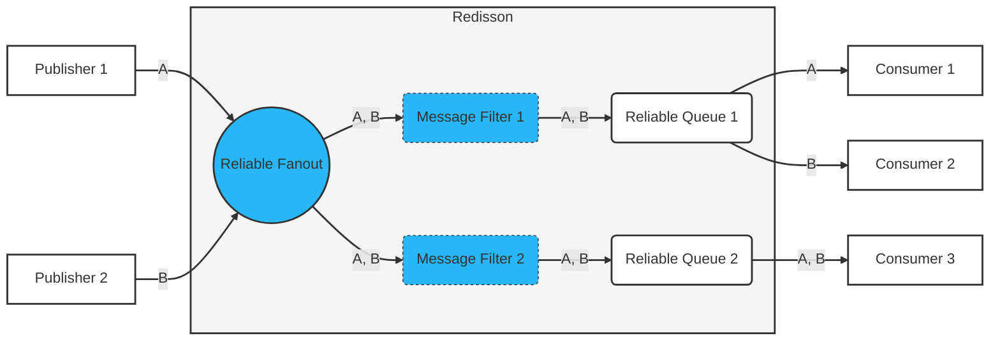

## Reliable Queue

_This feature is available only in [Redisson PRO](https://redisson.pro/feature-comparison.html) edition._

The [Reliable Queue](https://www.javadoc.io/doc/org.redisson/redisson/latest/org/redisson/api/RReliableQueue.html) object is a specialized FIFO queue implementation built on top of  Valkey or Redis that provides robust message processing and advanced queue management features. The implementation doesn't use a standard Valkey or Redis queue, but a complex data structure that includes stream. This object is fully thread-safe.

Unlike standard Valkey and Redis queues, the Reliable Queue ensures message delivery even in failure scenarios, provides acknowledgment mechanisms, and offers fine-grained control over message handling. Moreover, Valkey and Redis [persistence with synchronized replication](#durability-and-synchronous-replication) significantly increases queue reliability by maintaining multiple consistent copies of data across nodes, ensuring that messages remain available even during node failures or network disruptions.

### Features

- **Queue Size Limit**: Ability to set maximum capacity to prevent unbounded growth and resource exhaustion.

- **Message Visibility Timeout**: Configurable time period during which a message is invisible to other consumers after being retrieved. This prevents duplicate processing and allows the message to reappear in the queue if it wasn't acknowledged during that timeout.

- **Message Delivery Limit**: Maximum number of delivery attempts for a message before it's considered undeliverable and deleted or moved to Dead Letter Queue (DLQ) if configured.

- **Message Size Limit**: Ability to restrict the size of messages to maintain performance.

- **Message Headers**: Each message can have attached key-value metadata.

- **Message Expiration Timeout**: Automatic removal of messages from the queue after a specified time period.

- **Message Priorities**: Ability to prioritize certain messages for faster processing.

- **Message Delay**: Schedule messages for future delivery with configurable delay periods.

- **Message Deduplication**: Prevent duplicate message processing by object value used as ID or message payload hash within a configurable time interval.

- **Acknowledgments**: Ability to acknowledge messages after successful processing, ensuring messages aren't lost during processing.

- **Negative Acknowledgments**: Ability to negatively acknowledge messages that cannot be processed as failed or rejected, allowing for custom error handling strategies. Failed messages are redelivered and rejected are deleted or moved to Dead Letter Queue (DLQ) if configured.

- **Bulk Operations**: Supports processing multiple messages in a single operation to improve throughput, including operations for adding, polling, moving, removing, acknowledging, and negatively acknowledging messages. 

- **Short Polling and Long Polling**: Support both immediate return and wait-for-message polling.

- **Operation Control**: Ability to selectively disable or enable queue operations (add, poll) for maintenance, troubleshooting, or load management.

- **Event Listeners**: Supports binding event listeners to key queue events such as message addition, polling, acknowledgment, negative acknowledgment, and removal.

- **Durability and Synchronous Replication**: Data redundancy across Valkey or Redis nodes with forced synchronous replication per operation to prevent message loss during node failures.

- **Dead-Letter Queue (DLQ)**: If a message reached delivery limit or rejected it's transferred to a Dead Letter Queue (DLQ). It's  a separate instance of Reliable Queue which stores messages for later analysis or reprocessing.

- **Atomic Operations**: All queue operations are executed atomically. This ensures data consistency and prevents race conditions.

- **No Periodic Tasks**: The queue operates without relying on periodic background tasks, reducing system overhead and improving reliability.

- **No Message Broker**: Operates directly on Valkey or Redis without requiring a separate message-broker component and avoiding extra points of failure.

### Configuration

**Queue-Level Settings**

Queue settings can be changed at runtime. All settings are optional. If not set, default values are used.

- `deliveryLimit` - Defines the maximum number of delivery attempts for a message. Once this limit is reached, the message may be moved to a dead letter queue if it's configured, otherwise it will be deleted. 
Can be overridden when adding a message. Default value is `10`.

- `visibility` - Sets the duration for which a message becomes invisible to other consumers after being polled. This prevents multiple consumers from processing the same message simultaneously. Can be overridden when pooling a message. Default value is `30 seconds`.

- `timeToLive` - Sets the time-to-live duration for messages in the queue. Messages will be automatically removed from the queue after this duration expires. `0` value means expiration is not applied. Can be overridden when adding a message. Default value is `0`.

- `deadLetterQueueName` - Sets the name of the Dead Letter Queue (DLQ) to which messages that have reached the delivery limit or have been rejected are sent. Dead letter queue can be removed by setting `null` value. Default value is `null`.

- `maxMessageSize` - Sets the maximum allowed size (in bytes) for a single message in the queue. Messages exceeding this size will be rejected. `0` value means size limit is not applied. Default value is `0`.

- `delay` - Sets the delay duration before a message becomes available for consumption after being added to the queue.`0` value means delay duration is not applied. Can be overridden when adding a message. Default value is `0`.

- `maxSize` - Sets the maximum number of messages that can be stored in the queue. When the queue reaches this size, add messages operation may be blocked and/or return empty result. `0` value means queue size limit is not applied. Default value is `0`.

- `processingMode` - Sets the processing mode for the queue which determines how messages are processed by consumers: 
	- 	`SEQUENTIAL` - messages are consumed strictly in the order they arrive in the queue. This mode enforces that only one message is actively processed at a time, preventing subsequent messages from becoming available until the current message is either acknowledged or its visibility timeout expires. 
	- 	`PARALLEL` - multiple messages can be consumed concurrently. This mode allows to distribute the messages processing load across multiple consumers simultaneously.

	Default value is `PARALLEL`.


Code example of the reliable queue config definition:

=== "Sync"
    ```java
    RReliableQueue<MyObject> rq = redisson.getReliableQueue("myqueue");

    // or instance with a custom codec defined
    RReliableQueue<MyObject> rq = redisson.getReliableQueue("myqueue", new CustomCodec());


    // overrides the previously set configuration
    rq.setConfig(QueueConfig.defaults()
                       .deliveryLimit(4)
                       .visibilityTimeout(Duration.ofSeconds(60))
                       .timeToLive());
    
    // applies the configuration only if no configuration has been set previously
    rq.setConfigIfAbsent(QueueConfig.defaults()
                       .deliveryLimit(4)
                       .visibilityTimeout(Duration.ofSeconds(60))
                       .timeToLive());
    ```
=== "Async"
    ```java
    RReliableQueueAsync<MyObject> rq = redisson.getReliableQueue("myqueue");

    // or instance with a custom codec defined
    RReliableQueueAsync<MyObject> rq = redisson.getReliableQueue("myqueue", new CustomCodec());


    // overrides the previously set configuration
    RFuture<Void> sfr = rq.setConfigAsync(QueueConfig.defaults()
                                           .deliveryLimit(4)
                                           .visibilityTimeout(Duration.ofSeconds(60))
                                           .timeToLive());
    
    // applies the configuration only if no configuration has been set previously
    RFuture<Boolean> rtsf = rq.setConfigIfAbsentAsync(QueueConfig.defaults()
                                                   .deliveryLimit(4)
                                                   .visibilityTimeout(Duration.ofSeconds(60))
                                                   .timeToLive());
    ```
=== "Reactive"
    ```java
    RedissonReactiveClient redisson = redissonClient.reactive();
    RReliableQueueReactive<MyObject> rq = redisson.getReliableQueue("myqueue");

    // or instance with a custom codec defined
    RReliableQueueReactive<MyObject> rq = redisson.getReliableQueue("myqueue", new CustomCodec());


    // overrides the previously set configuration
    Mono<Void> sfr = rq.setConfig(QueueConfig.defaults()
                                   .deliveryLimit(4)
                                   .visibilityTimeout(Duration.ofSeconds(60))
                                   .timeToLive());
    
    // applies the configuration only if no configuration has been set previously
    Mono<Boolean> rtsf = rq.setConfigIfAbsent(QueueConfig.defaults()
                                           .deliveryLimit(4)
                                           .visibilityTimeout(Duration.ofSeconds(60))
                                           .timeToLive());
    ```
=== "RxJava3"
    ```java
    RedissonRxClient redisson = redissonClient.rxJava();
    RReliableQueueRx<MyObject> rq = redisson.getReliableQueue("myqueue");

    // or instance with a custom codec defined
    RReliableQueueRx<MyObject> rq = redisson.getReliableQueue("myqueue", new CustomCodec());


    // overrides the previously set configuration
    Completable sfr = rq.setConfig(QueueConfig.defaults()
                                       .deliveryLimit(4)
                                       .visibilityTimeout(Duration.ofSeconds(60))
                                       .timeToLive());
    
    // applies the configuration only if no configuration has been set previously
    Single<Boolean> tsf = rq.setConfigIfAbsent(QueueConfig.defaults()
                                           .deliveryLimit(4)
                                           .visibilityTimeout(Duration.ofSeconds(60))
                                           .timeToLive());
    ```

**Message-Level Settings**

Message settings applied to `add()` and `addMany()` methods. All settings are optional except for `payload`. If optional settings are not set, defaults will be used.

- `payload` - Defines the data to include in the message. The codec defined for the queue is used for data serialization and deserialization. **required setting**

- `deliveryLimit` - Message Delivery Limit. Allows to specify the maximum number of delivery attempts for a message, after which it can be moved to Dead Letter Queue (DLQ) if configured. The delivery attempt count increases each time a message is redelivered after the visibility timeout is reached or when the message is negatively acknowledged with a failed status.
<br>
Minimal value is `1`. If not defined, the queue's deliveryLimit setting value is used. If queue's deliveryLimit setting is also not set, the default value is `10`.

- `timeToLive` - Message Expiration Timeout. Allows you to set a time-to-live (TTL) for messages in the queue, after which they are automatically removed if not processed. 
<br>
`0` value means expiration is not applied. If not defined, the queue's timeToLive setting value is used. If queue's timeToLive setting is also not set, the default value is `0`.

- `header` \ `headers` - Message headers. Allow to attach metadata to messages without modifying the payload, enabling richer communication patterns and more sophisticated routing. Separates metadata from core message content.

- `delay` - Message Delay. Allows to schedule messages for future delivery, with precise timing control down to the millisecond.
<br>
`0` value means delay duration is not applied. If not defined, the queue's delay setting value is used. If queue's delay setting is also not set, the default value is `0`.

- `priority` - Message Priorities. Allows to assign importance levels to messages, ensuring critical messages are processed before less important ones. Ensures critical operations take precedence. 
<br>
Priority defined as a number between 0 and 9. `0` - the lowest priority level. `9` - the highest priority level. Default value is `0`.

- `deduplicationById` - Message Deduplication by ID. Enables deduplication based on a custom value used as ID for the specified interval. During the specified interval, messages with the same ID will be considered duplicates and won't be added to the queue.

- `deduplicationByHash` - Message Deduplication by Hash. Enables deduplication based on the message payload hash for the specified interval. During the specified interval, messages with the same hash will be considered duplicates and won't be added to the queue.


### Adding Messages

Messages are added to the queue via `add()` and `addMany()` methods and are then available for consumption upon return from the method.

The `add()` and `addMany()` methods each return a Message object for every added message, containing the payload, headers (identical to those of the original message) and a unique ID generated by the queue.

Below are the available settings per method call:

- `timeout` - Sets the maximum time to wait when adding messages to a full queue with a limited size. If the queue is full, the add method will block until either:
	- Space becomes available and the message(s) are successfully added.
	- The specified timeout duration elapses.

	`0` means to wait indefinitely until space becomes available. If the timeout elapses before the message(s) can be added, the `add()` method returns `null`, while the `addMany()` method returns an empty collection.

- `headersCodec` - Specifies the codec to be used for message headers serialization.


**Non-blocking Enqueue (Unbounded Queue)**

For queues without a size limit (`maxSize = 0`, the default), enqueue operations are always non-blocking. The message is added immediately, and the method returns as soon as the operation is complete.


Code examples of messages adding:

=== "Sync"

	```java
	RReliableQueue<MyObject> rq = redisson.getReliableQueue("myqueue");
	
	MyObject data = new MyObject();
	
	Message<MyObject> msg = rq.add(QueueAddArgs.messages(MessageArgs.payload(data)
	                                                       .deliveryLimit(10)
	                                                       .timeToLive(Duration.ofDays(24))
	                                                       .header("key1", new MyDataValue())
	                                                       .header("key2", new MyDataValue())
	                                                       .delay(Duration.ofSeconds(45))
	                                                       .priority(3)
	                                                       .deduplicationById("myid", Duration.ofHours(23))));
	
	String id = msg.getId();
	MyObject data = msg.getPayload();
	Map<String, MyDataValue> headers = msg.getHeaders();
	
	// adding messages in a batch
	List<Message<MyObject>> msgs =  rq.addMany(QueueAddArgs.messages(MessageArgs.payload(data1), 
	                                                                 MessageArgs.payload(data2), 
	                                                                 MessageArgs.payload(data3)));
	
	```

=== "Async"

    ```java
    RReliableQueueAsync<MyObject> rq = redisson.getReliableQueue("myqueue");
    
    MyObject data = new MyObject();
    
    RFuture<Message<MyObject>> msg = rq.addAsync(QueueAddArgs.messages(MessageArgs.payload(data)
                                                           .deliveryLimit(10)
                                                           .timeToLive(Duration.ofDays(24))
                                                           .header("key1", new MyDataValue())
                                                           .header("key2", new MyDataValue())
                                                           .delay(Duration.ofSeconds(45))
                                                           .priority(3)
                                                           .deduplicationById("myid", Duration.ofHours(23))));
    
    String id = msg.getId();
    MyObject data = msg.getPayload();
    Map<String, MyDataValue> headers = msg.getHeaders();
    
    // adding messages in a batch
    RFuture<List<Message<MyObject>>> msgs =  rq.addManyAsync(QueueAddArgs.messages(MessageArgs.payload(data1), 
                                                                     MessageArgs.payload(data2), 
                                                                     MessageArgs.payload(data3)));
    
    ```

=== "Reactive"

    ```java
    RedissonReactiveClient redisson = redissonClient.reactive();
    RReliableQueueReactive<MyObject> rq = redisson.getReliableQueue("myqueue");
    
    MyObject data = new MyObject();
    
    Mono<Message<MyObject>> msg = rq.add(QueueAddArgs.messages(MessageArgs.payload(data)
                                                           .deliveryLimit(10)
                                                           .timeToLive(Duration.ofDays(24))
                                                           .header("key1", new MyDataValue())
                                                           .header("key2", new MyDataValue())
                                                           .delay(Duration.ofSeconds(45))
                                                           .priority(3)
                                                           .deduplicationById("myid", Duration.ofHours(23))));
    
    String id = msg.getId();
    MyObject data = msg.getPayload();
    Map<String, MyDataValue> headers = msg.getHeaders();
    
    // adding messages in a batch
    Mono<List<Message<MyObject>>> msgs =  rq.addMany(QueueAddArgs.messages(MessageArgs.payload(data1), 
                                                                     MessageArgs.payload(data2), 
                                                                     MessageArgs.payload(data3)));
    
    ```

=== "RxJava3"

    ```java
    RedissonRxClient redisson = redissonClient.rxJava();
    RReliableQueueRx<MyObject> rq = redisson.getReliableQueue("myqueue");
    
    MyObject data = new MyObject();
    
    Maybe<Message<MyObject>> msg = rq.add(QueueAddArgs.messages(MessageArgs.payload(data)
                                                           .deliveryLimit(10)
                                                           .timeToLive(Duration.ofDays(24))
                                                           .header("key1", new MyDataValue())
                                                           .header("key2", new MyDataValue())
                                                           .delay(Duration.ofSeconds(45))
                                                           .priority(3)
                                                           .deduplicationById("myid", Duration.ofHours(23))));
    
    String id = msg.getId();
    MyObject data = msg.getPayload();
    Map<String, MyDataValue> headers = msg.getHeaders();
    
    // adding messages in a batch
    Single<List<Message<MyObject>>> msgs =  rq.addMany(QueueAddArgs.messages(MessageArgs.payload(data1), 
                                                                     MessageArgs.payload(data2), 
                                                                     MessageArgs.payload(data3)));
    
    ```

**Blocking Enqueue (Bounded Queue)**

When the queue has a maximum size (`maxSize > 0`), enqueue operations will be blocked if the queue is full and `timeout` setting is defined. `timeout` settings is used to control how long the operation waits for space to become available.

Code examples of messages adding to a queue with limited size:

=== "Sync"
    ```java
    RReliableQueue<MyObject> rq = redisson.getReliableQueue("myqueue");

    MyObject data = new MyObject();
    
    // adding message with timeout in 120 seconds
    Message<MyObject> msg = rq.add(QueueAddArgs.messages(MessageArgs.payload(data)
                                                           .delay(Duration.ofSeconds(45))
                                                           .deduplicationById("myid", Duration.ofHours(23)))
    		                                               .timeout(Duration.ofSeconds(120)));
    
    // adding messages in a batch with timeout in 90 seconds
    List<Message<MyObject>> msgs =  rq.addMany(QueueAddArgs.messages(MessageArgs.payload(data1), 
                                                                     MessageArgs.payload(data2), 
                                                                     MessageArgs.payload(data3))
                                                           .timeout(Duration.ofSeconds(90)));
    
    ```
=== "Async"
    ```java
    RReliableQueueAsync<MyObject> rq = redisson.getReliableQueue("myqueue");

    MyObject data = new MyObject();
    
    // adding message with timeout in 120 seconds
    RFuture<Message<MyObject>> msg = rq.addAsync(QueueAddArgs.messages(MessageArgs.payload(data)
                                                           .delay(Duration.ofSeconds(45))
                                                           .deduplicationById("myid", Duration.ofHours(23)))
    		                                               .timeout(Duration.ofSeconds(120)));
    
    // adding messages in a batch with timeout in 90 seconds
    RFuture<List<Message<MyObject>>> msgs =  rq.addManyAsync(QueueAddArgs.messages(MessageArgs.payload(data1), 
                                                                     MessageArgs.payload(data2), 
                                                                     MessageArgs.payload(data3))
                                                           .timeout(Duration.ofSeconds(90)));
    
    ```
=== "Reactive"
    ```java
    RedissonReactiveClient redisson = redissonClient.reactive();
    RReliableQueueReactive<MyObject> rq = redisson.getReliableQueue("myqueue");

    MyObject data = new MyObject();
    
    // adding message with timeout in 120 seconds
    Mono<Message<MyObject>> msg = rq.add(QueueAddArgs.messages(MessageArgs.payload(data)
                                                           .delay(Duration.ofSeconds(45))
                                                           .deduplicationById("myid", Duration.ofHours(23)))
    		                                               .timeout(Duration.ofSeconds(120)));
    
    // adding messages in a batch with timeout in 90 seconds
    Mono<List<Message<MyObject>>> msgs =  rq.addMany(QueueAddArgs.messages(MessageArgs.payload(data1), 
                                                                     MessageArgs.payload(data2), 
                                                                     MessageArgs.payload(data3))
                                                           .timeout(Duration.ofSeconds(90)));
    
    ```
=== "RxJava3"
    ```java
    RedissonRxClient redisson = redissonClient.rxJava();
    RReliableQueueRx<MyObject> rq = redisson.getReliableQueue("myqueue");

    MyObject data = new MyObject();
    
    // adding message with timeout in 120 seconds
    Maybe<Message<MyObject>> msg = rq.add(QueueAddArgs.messages(MessageArgs.payload(data)
                                                           .delay(Duration.ofSeconds(45))
                                                           .deduplicationById("myid", Duration.ofHours(23)))
    		                                               .timeout(Duration.ofSeconds(120)));
    
    // adding messages in a batch with timeout in 90 seconds
    Single<List<Message<MyObject>>> msgs =  rq.addMany(QueueAddArgs.messages(MessageArgs.payload(data1), 
                                                                     MessageArgs.payload(data2), 
                                                                     MessageArgs.payload(data3))
                                                           .timeout(Duration.ofSeconds(90)));
    
    ```


### Polling Messages

The `poll()` and `pollMany()` methods each return a Message object or list of Message objects. These methods are resubscribed automatically during re-connection to a Valkey or Redis node or failover.

Below are the available settings per method call:

- `acknowledgeMode` - Sets the acknowledgment mode which determines how messages are acknowledged after retrieval: 
	- 	`AUTO` - messages are automatically acknowledged after delivery. 
	- 	`MANUAL` - messages must be explicitly acknowledged by the consumer.

	Default value is `MANUAL`.
	
- `visibility` -  Temporarily hides a message from other consumers after it's been received by one consumer. This prevents multiple consumers from processing the same message simultaneously. Automatically requeues messages if processing fails or crashes. 
<br>
If not defined, the queue's visibility setting value is used. If queue's visibility setting is also not set, the default value is `30 seconds`.

- `timeout` - Sets the maximum time to wait for messages to become available. If the queue is empty, the poll operation will block until either:
	- At least one message becomes available.
	- The specified timeout duration elapses.

	`0` means to wait indefinitely for a message. If the timeout elapses without any messages becoming available, the `poll()` method returns null, while the `pollMany()` method returns an empty collection.

- `count` - Sets the maximum number of messages to retrieve in a single poll operation. This parameter enables batch retrieval of messages, which can improve throughput when processing multiple messages at once. The actual number of messages returned may be less than the requested count if fewer messages are available.

- `headersCodec` - Specifies the codec to be used for message headers deserialization.

**Short polling**

Short polling returns immediate response with or without messages.

Code examples of short polling:

=== "Sync"
    ```java
    RReliableQueue<MyObject> rq = redisson.getReliableQueue("myqueue");


    // polling a single message
    Message<MyObject> msg = rq.poll(QueuePollArgs.defaults()
                                                .visibility(Duration.ofSeconds(10))
                                                .headersCodec(new CustomCodec())
                                                .acknowledgeMode(AcknowledgeMode.MANUAL));


    // polling messages in a batch
    List<Message<MyObject>> msgs = rq.pollMany(QueuePollArgs.defaults()
                                                .acknowledgeMode(AcknowledgeMode.AUTO)
                                                .count(10));
    ```
=== "Async"
    ```java
    RReliableQueueAsync<MyObject> rq = redisson.getReliableQueue("myqueue");


    // polling a single message
    RFuture<Message<MyObject>> msg = rq.pollAsync(QueuePollArgs.defaults()
                                                .visibility(Duration.ofSeconds(10))
                                                .headersCodec(new CustomCodec())
                                                .acknowledgeMode(AcknowledgeMode.MANUAL));


    // polling messages in a batch
    RFuture<List<Message<MyObject>>> msgs = rq.pollManyAsync(QueuePollArgs.defaults()
                                                .acknowledgeMode(AcknowledgeMode.AUTO)
                                                .count(10));
    ```
=== "Reactive"
    ```java
    RedissonReactiveClient redisson = redissonClient.reactive();
    RReliableQueueReactive<MyObject> rq = redisson.getReliableQueue("myqueue");


    // polling a single message
    Mono<Message<MyObject>> msg = rq.poll(QueuePollArgs.defaults()
                                                .visibility(Duration.ofSeconds(10))
                                                .headersCodec(new CustomCodec())
                                                .acknowledgeMode(AcknowledgeMode.MANUAL));


    // polling messages in a batch
    Mono<List<Message<MyObject>>> msgs = rq.pollMany(QueuePollArgs.defaults()
                                                .acknowledgeMode(AcknowledgeMode.AUTO)
                                                .count(10));
    ```
=== "RxJava3"
    ```java
    RedissonRxClient redisson = redissonClient.rxJava();
    RReliableQueueRx<MyObject> rq = redisson.getReliableQueue("myqueue");


    // polling a single message
    Maybe<Message<MyObject>> msg = rq.poll(QueuePollArgs.defaults()
                                                .visibility(Duration.ofSeconds(10))
                                                .headersCodec(new CustomCodec())
                                                .acknowledgeMode(AcknowledgeMode.MANUAL));


    // polling messages in a batch
    Single<List<Message<MyObject>>> msgs = rq.pollMany(QueuePollArgs.defaults()
                                                .acknowledgeMode(AcknowledgeMode.AUTO)
                                                .count(10));
    ```


**Long polling**

Long polling waits for messages to arrive with specified `timeout` setting.

Code examples of long polling:

=== "Sync"
    ```java
    RReliableQueue<MyObject> rq = redisson.getReliableQueue("myqueue");


    // polling a single message
    Message<MyObject> msg = rq.poll(QueuePollArgs.defaults()
                                                .visibility(Duration.ofSeconds(10))
                                                .headersCodec(new CustomCodec())
                                                .acknowledgeMode(AcknowledgeMode.AUTO)
                                                .timeout(Duration.ofSeconds(140)));


    // polling messages in a batch
    List<Message<MyObject>> msgs = rq.pollMany(QueuePollArgs.defaults()
                                                .acknowledgeMode(AcknowledgeMode.MANUAL)
                                                .timeout(Duration.ofSeconds(120)
                                                .count(10));
    ```
=== "Async"
    ```java
    RReliableQueueAsync<MyObject> rq = redisson.getReliableQueue("myqueue");


    // polling a single message
    RFuture<Message<MyObject>> msg = rq.pollAsync(QueuePollArgs.defaults()
                                                        .visibility(Duration.ofSeconds(10))
                                                        .headersCodec(new CustomCodec())
                                                        .acknowledgeMode(AcknowledgeMode.AUTO)
                                                        .timeout(Duration.ofSeconds(140)));


    // polling messages in a batch
    RFuture<List<Message<MyObject>>> msgs = rq.pollManyAsync(QueuePollArgs.defaults()
                                                                .acknowledgeMode(AcknowledgeMode.MANUAL)
                                                                .timeout(Duration.ofSeconds(120)
                                                                .count(10));
    ```
=== "Reactive"
    ```java
    RedissonReactiveClient redisson = redissonClient.reactive();    
    RReliableQueueReactive<MyObject> rq = redisson.getReliableQueue("myqueue");


    // polling a single message
    Mono<Message<MyObject>> msg = rq.poll(QueuePollArgs.defaults()
                                                .visibility(Duration.ofSeconds(10))
                                                .headersCodec(new CustomCodec())
                                                .acknowledgeMode(AcknowledgeMode.AUTO)
                                                .timeout(Duration.ofSeconds(140)));


    // polling messages in a batch
    Mono<List<Message<MyObject>>> msgs = rq.pollMany(QueuePollArgs.defaults()
                                                        .acknowledgeMode(AcknowledgeMode.MANUAL)
                                                        .timeout(Duration.ofSeconds(120)
                                                        .count(10));
    ```
=== "RxJava3"
    ```java
    RedissonRxClient redisson = redissonClient.rxJava();
    RReliableQueueRx<MyObject> rq = redisson.getReliableQueue("myqueue");


    // polling a single message
    Maybe<Message<MyObject>> msg = rq.poll(QueuePollArgs.defaults()
                                                .visibility(Duration.ofSeconds(10))
                                                .headersCodec(new CustomCodec())
                                                .acknowledgeMode(AcknowledgeMode.AUTO)
                                                .timeout(Duration.ofSeconds(140)));


    // polling messages in a batch
    Single<List<Message<MyObject>>> msgs = rq.pollMany(QueuePollArgs.defaults()
                                                                .acknowledgeMode(AcknowledgeMode.MANUAL)
                                                                .timeout(Duration.ofSeconds(120)
                                                                .count(10));
    ```

### Acknowledging Messages

Message acknowledgment is required for messages polled with the `acknowledgeMode` setting set to `AcknowledgeMode.MANUAL`.

**Acknowledgments**

Acknowledgments require consumers to explicitly confirm successful processing of messages, ensuring reliable delivery and processing. Supports exactly-once processing semantics. When a message is acknowledged, it is deleted from the queue. 

Code examples of message acknowledgment:

=== "Sync"
    ```java
    RReliableQueue<Integer> rq = redisson.getReliableQueue("myqueue");

    // message id
    String mid = ...
    rq.acknowledge(QueueAckArgs.ids(mid));
    
    // message ids
    String[] mids = ...
    // acknowledge message ids in a batch
    rq.acknowledge(QueueAckArgs.ids(mids));
    
    ```
=== "Async"
    ```java
    RReliableQueueAsync<Integer> rq = redisson.getReliableQueue("myqueue");

    // message id
    String mid = ...
    RFuture<Void> ack = rq.acknowledgeAsync(QueueAckArgs.ids(mid));
    
    // message ids
    String[] mids = ...
    // acknowledge message ids in a batch
    RFuture<Void> ack = rq.acknowledgeAsync(QueueAckArgs.ids(mids));
    
    ```
=== "Reactive"
    ```java
    RedissonReactiveClient redisson = redissonClient.reactive();
    RReliableQueueReactive<Integer> rq = redisson.getReliableQueue("myqueue");

    // message id
    String mid = ...
    Mono<Void> mn = rq.acknowledge(QueueAckArgs.ids(mid));
    
    // message ids
    String[] mids = ...
    // acknowledge message ids in a batch
    Mono<Void> mn = rq.acknowledge(QueueAckArgs.ids(mids));
    
    ```
=== "RxJava3"
    ```java
    RedissonRxClient redisson = redissonClient.rxJava();
    RReliableQueueRx<MyObject> rq = redisson.getReliableQueue("myqueue");

    // message id
    String mid = ...
    Completable ack = rq.acknowledge(QueueAckArgs.ids(mid));
    
    // message ids
    String[] mids = ...
    // acknowledge message ids in a batch
    Completable ack = rq.acknowledge(QueueAckArgs.ids(mids));
    
    ```

**Negative Acknowledgments**

Negative acknowledgments allow consumers to explicitly mark messages with one of the following statuses:

- `Failed` - indicates that the client application failed to process the message. The message is redelivered. Allows to define the delay duration before the failed message is eligible for redelivery.

- `Rejected` - indicates that the client application could process the message, but it was not accepted. The message is removed and moved to the Dead Letter Queue (DLQ) if configured.

Code examples of negative message acknowledgment:

=== "Sync"
    ```java
    RReliableQueue<Integer> rq = redisson.getReliableQueue("myqueue");

    // message id
    String mid = ...
    // mark message as failed with delay in 17 seconds for redelivery
    rq.negativeAcknowledge(QueueNegativeAckArgs
                                        .failed(mid)
                                        .delay(Duration.ofSeconds(17)));
    
    // mark message as rejected
    rq.negativeAcknowledge(QueueNegativeAckArgs
                                        .rejected(mid));


    // message ids
    String[] mids = ...
    
    // mark messages as failed in a batch with delay in 9 seconds for redelivery
    rq.negativeAcknowledge(QueueNegativeAckArgs
                                        .failed(mids)
                                        .delay(Duration.ofSeconds(9)));
    
    // mark messages as rejected in a batch
    rq.negativeAcknowledge(QueueNegativeAckArgs
                                        .rejected(mids));
    ```
=== "Async"
    ```java
    RReliableQueueAsync<Integer> rq = redisson.getReliableQueue("myqueue");

    // message id
    String mid = ...
    // mark message as failed with delay in 17 seconds for redelivery
    RFuture<Void> rf = rq.negativeAcknowledgeAsync(QueueNegativeAckArgs
                                                        .failed(mid)
                                                .delay(Duration.ofSeconds(17)));
    
    // mark message as rejected
    RFuture<Void> rf = rq.negativeAcknowledgeAsync(QueueNegativeAckArgs
                                                       .rejected(mid));


    // message ids
    String[] mids = ...
    
    // mark messages as failed in a batch with delay in 9 seconds for redelivery
    RFuture<Void> rf = rq.negativeAcknowledgeAsync(QueueNegativeAckArgs
                                                        .failed(mids)
                                                .delay(Duration.ofSeconds(9)));
    
    // mark messages as rejected in a batch
    RFuture<Void> rf = rq.negativeAcknowledgeAsync(QueueNegativeAckArgs
                                                        .rejected(mids));
    ```
=== "Reactive"
    ```java
    RReliableQueueReactive<Integer> rq = redisson.getReliableQueue("myqueue");

    // message id
    String mid = ...
    // mark message as failed with delay in 17 seconds for redelivery
    Mono<Void> rf = rq.negativeAcknowledge(QueueNegativeAckArgs
                                                .failed(mid)
                                                .delay(Duration.ofSeconds(17)));
    
    // mark message as rejected
    Mono<Void> rf = rq.negativeAcknowledge(QueueNegativeAckArgs
    	                                        .rejected(mid));


    // message ids
    String[] mids = ...
    
    // mark messages as failed in a batch with delay in 9 seconds for redelivery
    Mono<Void> rf = rq.negativeAcknowledge(QueueNegativeAckArgs
                                                .failed(mids)
                                                .delay(Duration.ofSeconds(9)));
    
    // mark messages as rejected in a batch
    Mono<Void> rf = rq.negativeAcknowledge(QueueNegativeAckArgs
    	                                        .rejected(mids));
    ```
=== "RxJava3"
    ```java
    RReliableQueueRx<Integer> rq = redisson.getReliableQueue("myqueue");

    // message id
    String mid = ...
    // mark message as failed with delay in 17 seconds for redelivery
    Completable rf = rq.negativeAcknowledge(QueueNegativeAckArgs
                                                .failed(mid)
                                                .delay(Duration.ofSeconds(17)));
    
    // mark message as rejected
    Completable rf = rq.negativeAcknowledge(QueueNegativeAckArgs
    	                                        .rejected(mid));


    // message ids
    String[] mids = ...
    
    // mark messages as failed in a batch with delay in 9 seconds for redelivery
    Completable rf = rq.negativeAcknowledge(QueueNegativeAckArgs
                                                .failed(mids)
                                                .delay(Duration.ofSeconds(9)));
    
    // mark messages as rejected in a batch
    Completable rf = rq.negativeAcknowledge(QueueNegativeAckArgs
    		                                        .rejected(mids));
    ```

### Management and Monitoring

Messages can be inspected, removed or moved to another queue if necessary. 

- `listAll()` method returns all messages in the queue, ready to be retrieved by the `poll()` command. Note that this method fetches all messages at once and can be time consuming for queues with a large number of messages.

- `move()` method moves messages from the queue to the end of the destination queue.

- `remove()` method removes messages from the queue.

- `size()` method returns the total number of messages in the queue ready for polling, excluding delayed and unacknowledged messages.
     
- `countDelayedMessages()` method returns the number of delayed messages in the queue.
  
- `countUnacknowledgedMessages()` method returns the number of unacknowledged messages in the queue.

- `get()` method returns message by id

- `getAll()` method returns messages by ids

Queue operations can be disabled or enabled if necessary:

- Disabling `ADD` operation prevents new messages from being added while allowing processing of existing messages.  
- Disabling `POLL` operation allows adding new messages while preventing consumption, essentially creating a backlog.

Selectively enabling/disabling send or receive operations can help isolate and troubleshoot application issues with messages handling. Queue operations can be temporarily disabled during system maintenance. Disabling certain queue operations during periods of high system load can prevent system overload and ensure stability. All messages are maintained in Valkey or Redis, ensuring that no data is lost.

- `disableOperation()` method disables a queue operation

- `enableOperation()` method enables a queue operation

Code examples of queue inspection:
=== "Sync"
    ```java
    RReliableQueue<MyObject> dlq = redisson.getReliableQueue("myqueue-dlq");

    // load all messages in the queue.
    List<Message<MyObject>> msgs = dlq.listAll();
	
	// get message by id
	Message<MyObject>> msg = dlq.get(id);

    // get messages by ids
	List<Message<MyObject>>> msgs = dlq.getAll(ids);
    ```
=== "Async"
    ```java
    RReliableQueueAsync<MyObject> dlq = redisson.getReliableQueue("myqueue-dlq");

    // load all messages in the queue.
    RFuture<List<Message<MyObject>>> msgs = dlq.listAllAsync();
	
	// get message by id
	RFuture<Message<MyObject>>> msg = dlq.getAsync(id);

    // get messages by ids
	RFuture<List<Message<MyObject>>>> msgs = dlq.getAllAsync(ids);	
    ```
=== "Reactive"
    ```java
    RedissonReactiveClient redisson = redissonClient.reactive();
    RReliableQueueReactive<MyObject> dlq = redisson.getReliableQueue("myqueue-dlq");

    // load all messages in the queue.
    Mono<List<Message<MyObject>>> msgs = dlq.listAll();
	
	// get message by id
	Mono<Message<MyObject>>> msg = dlq.get(id);

    // get messages by ids
	Mono<List<Message<MyObject>>>> msgs = dlq.getAll(ids);	
    ```
=== "RxJava3"
    ```java
    RedissonRxClient redisson = redissonClient.rxJava();
    RReliableQueueRx<MyObject> dlq = redisson.getReliableQueue("myqueue-dlq");

    // load all messages in the queue.
    Single<List<Message<MyObject>>> msgs = dlq.listAll();
	
	// get message by id
	Maybe<Message<MyObject>>> msg = dlq.get(id);

    // get messages by ids
	Single<List<Message<MyObject>>>> msgs = dlq.getAll(ids);		
    ```

Code examples of messages transition:
=== "Sync"
    ```java
    RReliableQueue<MyObject> dlq = redisson.getReliableQueue("myqueue-dlq");

    // move messages by id to the end of the destination queue
    // and get the number of messages moved
    int movedCount = dlq.move(QueueMoveArgs.move()
                                            .ids(id1, id2, id3)
                                            .destination("myqueue"));
    
    // move the first 10 messages from beginning of the queue
    // to the end of the destination queue
    // and get the number of messages moved
    int movedCount = dlq.move(QueueMoveArgs.move()
                                            .count(10)
                                            .destination("myqueue"));
    
    ```
=== "Async"
    ```java
    RReliableQueueAsync<MyObject> dlq = redisson.getReliableQueue("myqueue-dlq");

    // move messages by id to the end of the destination queue
    // and get the number of messages moved
    RFuture<Integer> movedCount = dlq.moveAsync(QueueMoveArgs.move()
                                                    .ids(id1, id2, id3)
                                                    .destination("myqueue"));
    
    // move the first 10 messages from beginning of the queue
    // to the end of the destination queue
    // and get the number of messages moved
    RFuture<Integer> movedCount = dlq.moveAsync(QueueMoveArgs.move()
                                                    .count(10)
                                                    .destination("myqueue"));
    
    ```
=== "Reactive"
    ```java
    RedissonReactiveClient redisson = redissonClient.reactive();
    RReliableQueueReactive<MyObject> dlq = redisson.getReliableQueue("myqueue-dlq");

    // move messages by id to the end of the destination queue
    // and get the number of messages moved
    Mono<Integer> movedCount = dlq.move(QueueMoveArgs.move()
                                            .ids(id1, id2, id3)
                                            .destination("myqueue"));
    
    // move the first 10 messages from beginning of the queue
    // to the end of the destination queue
    // and get the number of messages moved
    Mono<Integer> movedCount = dlq.move(QueueMoveArgs.move()
                                            .count(10)
                                            .destination("myqueue"));
    
    ```
=== "RxJava3"
    ```java
    RedissonRxClient redisson = redissonClient.rxJava();
    RReliableQueueRx<MyObject> dlq = redisson.getReliableQueue("myqueue-dlq");

    // move messages by id to the end of the destination queue
    // and get the number of messages moved
    Single<Integer> movedCount = dlq.move(QueueMoveArgs.move()
                                            .ids(id1, id2, id3)
                                            .destination("myqueue"));
    
    // move the first 10 messages from beginning of the queue
    // to the end of the destination queue
    // and get the number of messages moved
    Single<Integer> movedCount = dlq.move(QueueMoveArgs.move()
                                            .count(10)
                                            .destination("myqueue"));
    
    ```

Code examples of messages removal:

=== "Sync"
    ```java
    RReliableQueue<MyObject> dlq = redisson.getReliableQueue("myqueue-dlq");

    // remove a single message
    // and get true if the message successfully removed
    boolean removed = dlq.remove(QueueRemoveArgs.ids(id1));
    
    // remove messages in a batch
    // and get the number of messages successfully removed
    int count = dlq.removeMany(QueueRemoveArgs.ids(id1));
    ```
=== "Async"
    ```java
    RReliableQueueAsync<MyObject> dlq = redisson.getReliableQueue("myqueue-dlq");

    // remove a single message
    // and get true if the message successfully removed
    RFuture<Boolean> removed = dlq.removeAsync(QueueRemoveArgs.ids(id1));
    
    // remove messages in a batch
    // and get the number of messages successfully removed
    RFuture<Integer> count = dlq.removeMany(QueueRemoveArgs.ids(id1));
    ```
=== "Reactive"
    ```java
    RedissonReactiveClient redisson = redissonClient.reactive();
    RReliableQueueReactive<MyObject> dlq = redisson.getReliableQueue("myqueue-dlq");

    // remove a single message
    // and get true if the message successfully removed
    Mono<Boolean> removed = dlq.remove(QueueRemoveArgs.ids(id1));
    
    // remove messages in a batch
    // and get the number of messages successfully removed
    Mono<Integer> count = dlq.removeMany(QueueRemoveArgs.ids(id1));
    ```
=== "RxJava3"
    ```java
    RedissonRxClient redisson = redissonClient.rxJava();
    RReliableQueueRx<MyObject> dlq = redisson.getReliableQueue("myqueue-dlq");

    // remove a single message
    // and get true if the message successfully removed
    Single<Boolean> removed = dlq.remove(QueueRemoveArgs.ids(id1));
    
    // remove messages in a batch
    // and get the number of messages successfully removed
    Single<Integer> count = dlq.removeMany(QueueRemoveArgs.ids(id1));
    ```

### Listeners

Redisson provides reliable event listener binding for `RReliableQueue` objects. Listeners receive messages sent during connection interruptions and failovers. When network issues occur or during failover, the listeners will not miss any notifications and receive them after reconnection.

|Listener class name|Event description |
|:--:|:--:|
|org.redisson.api.queue.event.AddedEventListener|Message added into queue|
|org.redisson.api.queue.event.PolledEventListener|Message polled from queue|
|org.redisson.api.queue.event.RemovedEventListener|Message removed from queue|
|org.redisson.api.queue.event.AcknowledgedEventListener|Message acknowledged|
|org.redisson.api.queue.event.NegativelyAcknowledgedEventListener|Message negatively acknowledged|
|org.redisson.api.queue.event.ConfigEventListener|Queue config is set|
|org.redisson.api.queue.event.DisabledOperationEventListener|Queue operation switched to disabled state|
|org.redisson.api.queue.event.EnabledOperationEventListener|Queue operation switched to enabled state|
|org.redisson.api.queue.event.FullEventListener|Queue is full|

Code examples of listeners usage:

=== "Sync"
	```java
	RReliableQueue<MyObject> queue = redisson.getReliableQueue("myqueue");

	String id = queue.addListener(new AddedEventListener() {
		 @Override
		 public void onAdded(List<String> ids) {
			// ...
		 }
	});

	// ...

	queue.removeListener(id);
	```
=== "Async"
	```java
	RReliableQueueAsync<MyObject> queue = redisson.getReliableQueue("myqueue");

	RFuture<String> f = queue.addListenerAsync(new AddedEventListener() {
		 @Override
		 public void onAdded(List<String> ids) {
			// ...
		 }
	});

	// ...

	RFuture<Void> vf = queue.removeListenerAsync(id);
	```
=== "Reactive"
	```java
	RedissonReactiveClient redisson = redissonClient.reactive();
	RReliableQueueReactive<MyObject> queue = redisson.getReliableQueue("myqueue");

	Mono<String> f = queue.addListener(new AddedEventListener() {
		 @Override
		 public void onAdded(List<String> ids) {
			// ...
		 }
	});

	// ...

	Mono<Void> vf = queue.removeListener(id);
	```
=== "RxJava3"
	```java
	RedissonRxClient redisson = redissonClient.rxJava();
	RReliableQueueRx<MyObject> queue = redisson.getReliableQueue("myqueue");

	Single<String> f = queue.addListener(new AddedEventListener() {
		 @Override
		 public void onAdded(List<String> ids) {
			// ...
		 }
	});

	// ...

	Completable vf = queue.removeListener(id);
	```

### Dead-Letter Queue (DLQ)

A Dead-Letter Queue (DLQ) is a specialized message queue used to store messages that cannot be processed or delivered due to errors or other issues. Instead of losing or endlessly retrying problematic messages, they are moved to the DLQ for later inspection and handling. This isolation mechanism significantly improves system reliability and prevents potential downtime, allowing applications to maintain continuous operations despite message processing failures.

Messages may be routed to a DLQ for a number of reasons:

- Message delivery attempts exceeds maximum delivery limit.
- Message was negatively acknowledged with reject status.

DLQ object has the same capabilities as Reliable Queue object. To start using it, define it in the queue configuration using `QueueConfig` object. This action registers the queue as a source queue for the DLQ.

Code examples of DLQ definition:
=== "Sync"
    ```java
    // source queue
    RReliableQueue<Integer> rq = redisson.getReliableQueue("myqueue");

    // defining dead-letter queue
    rq.setConfig(QueueConfig.defaults()
                            .deadLetterQueueName("myqueue-dlq"));
    ```
=== "Async"
    ```java
    // source queue
    RReliableQueueAsync<Integer> rq = redisson.getReliableQueue("myqueue");

    // defining dead-letter queue
    RFuture<Void> rf = rq.setConfigAsync(QueueConfig.defaults()
                            .deadLetterQueueName("myqueue-dlq"));
    ```
=== "Reactive"
    ```java
    // source queue
    RedissonReactiveClient redisson = redissonClient.reactive();
    RReliableQueueReactive<Integer> rq = redisson.getReliableQueue("myqueue");

    // defining dead-letter queue
    Mono<Void> rf = rq.setConfig(QueueConfig.defaults()
                            .deadLetterQueueName("myqueue-dlq"));
    ```
=== "RxJava3"
    ```java
    // source queue
    RReliableQueueRx<Integer> rq = redisson.getReliableQueue("myqueue");

    // defining dead-letter queue
    Completable rf = rq.setConfig(QueueConfig.defaults()
                            .deadLetterQueueName("myqueue-dlq"));
    ```


DLQ source queue names can be listed using `getDeadLetterQueueSources()` method.

Code examples of DLQ source queue names retrieval:

=== "Sync"
    ```java
    // dead-letter queue
    RReliableQueue<MyObject> dlq = redisson.getReliableQueue("myqueue-dlq");

    // returns 'myqueue'
    Set<String> sourceQueueNames = dlq.getDeadLetterQueueSources();
    ```
=== "Async"
    ```java
    // dead-letter queue
    RReliableQueueAsync<MyObject> dlq = redisson.getReliableQueue("myqueue-dlq");

    // returns 'myqueue'
    RFuture<Set<String>> sourceQueueNames = dlq.getDeadLetterQueueSourcesAsync();
    ```
=== "Reactive"
    ```java
    RedissonReactiveClient redisson = redissonClient.reactive();
    // dead-letter queue
    RReliableQueueReactive<MyObject> dlq = redisson.getReliableQueue("myqueue-dlq");

    // returns 'myqueue'
    Mono<Set<String>> sourceQueueNames = dlq.getDeadLetterQueueSources();
    ```
=== "RxJava3"
    ```java
    RedissonRxClient redisson = redissonClient.rxJava();
    // dead-letter queue
    RReliableQueueRx<MyObject> dlq = redisson.getReliableQueue("myqueue-dlq");

    // returns 'myqueue'
    Single<Set<String>> sourceQueueNames = dlq.getDeadLetterQueueSources();
    ```

### Durability and Synchronous Replication

The synchronization mechanism allows queue modification operations to be propagated to replica nodes in a controlled manner, ensuring data consistency across Valkey or Redis cluster. Additionally, Valkey and Redis persistence options, such as append-only files (AOF), and RDB snapshots, significantly increase queue reliability by preventing data loss during server restarts or failures, allowing for recovery of queued messages that would otherwise be lost when using only in-memory storage. 

Valkey and Redis use asynchronous replication. Reliable Queue introduces synchronous replication modes per operation to address the limitations of asynchronous replication. This capability with proper configuration of Valkey and Redis persistence transforms storage from a purely volatile memory store into a more robust message broker suitable for applications where message delivery guarantees are critical. This is particularly important for mission-critical applications where data loss is unacceptable.

Each queue modification operation can be configured with specific synchronization parameters:

- `syncMode` - Sets the synchronization mode to be used for current operation. Default value is `AUTO`.

	 Three synchronization strategies are available:
	
    - `AUTO` - Ensures data durability by blocking until write operations are confirmed as persisted to the memory  and the Append-Only File (AOF) on the primary Valkey or Redis node and replicas if the AOF persistence feature is enabled. If AOF persistence is unavailable, falls back to blocking until replica nodes acknowledge that write operations have been applied to memory. If neither durability mechanism is available, proceeds without synchronization guarantees.
	- `ACK` - Ensures data durability by blocking until replica nodes acknowledge that write operations have been applied to memory.
	- `ACK_AOF` - Ensures data durability by blocking until write operations are confirmed as persisted to the memory and the Append-Only File (AOF) on the primary Valkey or Redis node and replicas. Requires Redis 7.2.0+ or any Valkey version.
	
- `syncFailureMode` - Sets the behavior when synchronization with replica nodes fails. Default value is `LOG_WARNING`. 

	Two failure handling modes are available: 
	
    - `THROW_EXCEPTION` - Throw an exception to the caller. This mode is useful in scenarios where synchronization failures should be immediately visible and handled by the application code.
    - `LOG_WARNING` - Log a warning message but continue execution. This mode is suitable for non-critical synchronization operations where the application can continue functioning despite synchronization issues.

- `syncTimeout` - Sets the timeout duration for synchronization of the current operation. Defines how long the caller will wait for acknowledgment from replica nodes. Default value is `1 second`.

Code examples of synchronization parameters usage:
=== "Sync"
    ```java
    RReliableQueue<MyObject> rq = redisson.getReliableQueue("test");

    rq.add(QueueAddArgs.messages(MessageArgs.payload(data))
                            .syncMode(SyncMode.ACK_AOF)
                            .syncTimeout(Duration.ofSeconds(15))
                            .syncFailureMode(SyncFailureMode.LOG_WARNING));
    
    rq.poll(QueuePollArgs.defaults()
                            .syncMode(SyncMode.ACK)
                            .syncTimeout(Duration.ofSeconds(10))
                            .syncFailureMode(SyncFailureMode.THROW_EXCEPTION));
    
    rq.acknowledge(QueueAckArgs.ids(msg.getId())
                                .syncMode(SyncMode.AUTO)
                                .syncTimeout(Duration.ofSeconds(20)));
    
    rq.negativeAcknowledge(QueueNegativeAckArgs.rejected(msg.getId())
                                .syncMode(SyncMode.ACK)
                                .syncTimeout(Duration.ofSeconds(15)));
    
    ```
=== "Async"
    ```java
    RReliableQueue<MyObject> rq = redisson.getReliableQueue("test");

    RFuture<Message<MyObject>> arf = rq.addAsync(QueueAddArgs.messages(MessageArgs.payload(data))
                                                        .syncMode(SyncMode.ACK_AOF)
                                                        .syncTimeout(Duration.ofSeconds(15))
                                                        .syncFailureMode(SyncFailureMode.LOG_WARNING));
    
    RFuture<Message<MyObject>> prf = rq.pollAsync(QueuePollArgs.defaults()
                                                        .syncMode(SyncMode.ACK)
                                                        .syncTimeout(Duration.ofSeconds(10))
                                                        .syncFailureMode(SyncFailureMode.THROW_EXCEPTION));
    
    RFuture<Void> ack = rq.acknowledgeAsync(QueueAckArgs.ids(msg.getId())
                                                .syncMode(SyncMode.AUTO)
                                                .syncTimeout(Duration.ofSeconds(20)));
    
    RFuture<Void> nack = rq.negativeAcknowledgeAsync(QueueNegativeAckArgs.rejected(msg.getId())
                                                        .syncMode(SyncMode.ACK)
                                                        .syncTimeout(Duration.ofSeconds(15)));
    
    ```
=== "Reactive"
    ```java
    RedissonReactiveClient redisson = redissonClient.reactive();
    RReliableQueueReactive<MyObject> rq = redisson.getReliableQueue("test");

    Mono<Message<MyObject>> arf = rq.add(QueueAddArgs.messages(MessageArgs.payload(data))
                                                .syncMode(SyncMode.ACK_AOF)
                                                .syncTimeout(Duration.ofSeconds(15))
                                                .syncFailureMode(SyncFailureMode.LOG_WARNING));
    
    Mono<Message<MyObject>> prf = rq.poll(QueuePollArgs.defaults()
                                            .syncMode(SyncMode.ACK)
                                            .syncTimeout(Duration.ofSeconds(10))
                                            .syncFailureMode(SyncFailureMode.THROW_EXCEPTION));
    
    Mono<Void> ack = rq.acknowledge(QueueAckArgs.ids(msg.getId())
                                        .syncMode(SyncMode.AUTO)
                                        .syncTimeout(Duration.ofSeconds(20)));
    
    Mono<Void> nack =     rq.negativeAcknowledge(QueueNegativeAckArgs.rejected(msg.getId())
                                                        .syncMode(SyncMode.ACK)
                                                        .syncTimeout(Duration.ofSeconds(15)));
    
    ```
=== "RxJava3"
    ```java
    RedissonRxClient redisson = redissonClient.rxJava();
    RReliableQueueRx<MyObject> rq = redisson.getReliableQueue("test");

    Maybe<Message<MyObject>> arf =     rq.add(QueueAddArgs.messages(MessageArgs.payload(data))
                                                .syncMode(SyncMode.ACK_AOF)
                                                .syncTimeout(Duration.ofSeconds(15))
                                                .syncFailureMode(SyncFailureMode.LOG_WARNING));
    
    Maybe<Message<MyObject>> prf = rq.poll(QueuePollArgs.defaults()
                                            .syncMode(SyncMode.ACK)
                                            .syncTimeout(Duration.ofSeconds(10))
                                            .syncFailureMode(SyncFailureMode.THROW_EXCEPTION));
    
    Completable ack = rq.acknowledge(QueueAckArgs.ids(msg.getId())
                                        .syncMode(SyncMode.AUTO)
                                        .syncTimeout(Duration.ofSeconds(20)));
    
    Completable nack =     rq.negativeAcknowledge(QueueNegativeAckArgs.rejected(msg.getId())
                                                    .syncMode(SyncMode.ACK)
                                                    .syncTimeout(Duration.ofSeconds(15)));
    
    ```

### Metrics

Reliable Queue has metrics for monitoring a queue operation statistics.

Base name: `redisson.reliable-queue.<name>`

- `polls` - A Counter that counts the total number of executed poll operations.
- `polled-messages` - A Counter that counts the total number of messages retrieved from the queue through poll operations.
<br><br>

- `additions` - A Counter that counts the total number of executed add operations.
- `added-messages` - A Counter that counts the total number of messages added to the queue.
<br><br>

- `removals` - A Counter that counts the total number of executed removal operations.
- `removed-messages` - A Counter that counts the total number of messages removed from the queue.
<br><br>

- `movements` - A Counter that counts the total number of message moves to another queue.

- `moved-messages` - A Counter that counts the total number of messages moved to another queue.
<br><br>

- `acknowledgements` - A Counter that counts the total number of performed acknowledgment operations.

- `failed-acknowledgements` - A Counter that counts the total number of negative acknowledgements with failed status.

- `rejected-acknowledgements` - A Counter that counts the total number of negative acknowledgements with rejected status.
<br><br>

- `failed-synchronizations` - A Counter that counts the number of failed synchronization operations.

## Reliable Fanout

_This feature is available only in [Redisson PRO](https://redisson.pro/feature-comparison.html) edition._

Fanout architecture is a messaging pattern in which a single message from a producer is broadcast to multiple consumers. This approach is essential in scenarios where identical data must be delivered to several consumers at once. In a fanout setup, messages are distributed to all subscribed consumers, allowing each to receive the information instantly and in real time.

[Reliable Fanout](https://www.javadoc.io/doc/org.redisson/redisson/latest/org/redisson/api/RReliableFanout.html) object is built on top of Valkey or Redis and ensures message delivery to multiple [Reliable Queue](#reliable-queue) objects in a publish-subscribe model. Every published message is sent to each queue subscribed to the same fanout object. All fanout operations are executed atomically to ensure data consistency and prevent race conditions. This object is fully thread-safe.

The Reliable Fanout publish-subscribe model offers several advantages for distributed applications:

- Creates strong decoupling between publishers and subscribers, allowing components to evolve independently without affecting each other.

- Allows dynamic addition or removal of subscribers without disrupting publishers or other parts of the application.

- Compatible with modular architecture where components can be replaced or modified with minimal impact.

- Eliminates direct dependencies between message producers and consumers through name-based addressing.


Message flow example for two publishers and three consumers:


### Subscribing

Subscribers can be added or removed dynamically. Each subscriber is a ReliableQueue object that can even be not existed prior to subscription. 

Code examples of fanout object subscribing:

=== "Sync"

	```java
	RReliableFanout<MyObject> fanout = redisson.getReliableFanout("myfanout");
	
	// returns true if subscriber wasn't already subscribed
	fanout.subscribeQueue("beta-queue");
	
	// getting the subscribed queue
	RReliableQueue<MyObject> rq = redisson.getReliableQueue("beta-queue");
	```

=== "Async"

    ```java
    RReliableFanoutAsync<MyObject> fanout = redisson.getReliableFanout("myfanout");
    
	// returns true if subscriber wasn't already subscribed
	RFuture<Boolean> sfb = fanout.subscribeQueueAsync("beta-queue");

	// getting the subscribed queue
	RReliableQueueAsync<MyObject> rq = redisson.getReliableQueue("beta-queue");
    ```

=== "Reactive"

    ```java
    RedissonReactiveClient redisson = redissonClient.reactive();
    RReliableFanoutReactive<MyObject> rf = redisson.getReliableFanout("myfanout");
    
	// returns true if subscriber wasn't already subscribed
	Mono<Boolean> sfb = fanout.subscribeQueue("beta-queue");

	// getting the subscribed queue
	RReliableQueueReactive<MyObject> rq = redisson.getReliableQueue("beta-queue");
    ```

=== "RxJava3"

    ```java
    RedissonRxClient redisson = redissonClient.rxJava();
    RReliableFanoutRx<MyObject> rf = redisson.getReliableFanout("myfanout");
    
	// returns true if subscriber wasn't already subscribed
	Single<Boolean> sfb = fanout.subscribeQueue("beta-queue");

	// getting the subscribed queue
	RReliableQueueRx<MyObject> rq = redisson.getReliableQueue("beta-queue");
    ```

### Message Filtering

Every published message is sent to each subscriber by default. A message filter should be applied to the subscriber to receive only specific messages. The message filter allows for both payload- and header-based filtering. If filter method returns true, the message is delivered to the subscribed queue. 

Message filter is a plain Java object propagated to each Reliable Fanout instance with the same name and applied before each message publishing.

Filter can be set during subscription or after subscription through `setFilter()` method. It can be removed later using `removeFilter()` method.

Code examples for setting up a message filter:

=== "Sync"

	```java
	RReliableFanout<MyObject> fanout = redisson.getReliableFanout("myfanout");
	
	// returns true if subscriber wasn't already subscribed
    fanout.subscribeQueue("alpha-queue", (payload, headers) -> {
        return headers.containsKey("white-key") || payload.equals(someOjbect);
    });
	
	// returns true if subscriber wasn't already subscribed
	fanout.subscribeQueue("beta-queue");

    fanout.setFilter("beta-queue", (payload, headers) -> {
        return payload.equals(secondObject);
    });
	```

=== "Async"

    ```java
    RReliableFanoutAsync<MyObject> fanout = redisson.getReliableFanout("myfanout");
    
	// returns true if subscriber wasn't already subscribed
    RFuture<Boolean> sfa = fanout.subscribeQueueAsync("alpha-queue", (payload, headers) -> {
        return headers.containsKey("white-key") || payload.equals(someOjbect);
    });
	
	// returns true if subscriber wasn't already subscribed
	RFuture<Boolean> sfb = fanout.subscribeQueueAsync("beta-queue");
	
	// returns true if subscriber exists and filter was set
    RFuture<Boolean> fb =  fanout.setFilterAsync("beta-queue", (payload, headers) -> {
        return payload.equals(secondObject);
    });
    ```

=== "Reactive"

    ```java
    RedissonReactiveClient redisson = redissonClient.reactive();
    RReliableFanoutReactive<MyObject> rf = redisson.getReliableFanout("myfanout");
    
	// returns true if subscriber wasn't already subscribed
    Mono<Boolean> sfa = fanout.subscribeQueue("alpha-queue", (payload, headers) -> {
        return headers.containsKey("white-key") || payload.equals(someOjbect);
    });
	
	// returns true if subscriber wasn't already subscribed
	Mono<Boolean> sfb = fanout.subscribeQueue("beta-queue");
	
	// returns true if subscriber exists and filter was set
    Mono<Boolean> fb = fanout.setFilterAsync("beta-queue", (payload, headers) -> {
        return payload.equals(secondObject);
    });
    ```

=== "RxJava3"

    ```java
    RedissonRxClient redisson = redissonClient.rxJava();
    RReliableFanoutRx<MyObject> rf = redisson.getReliableFanout("myfanout");
    
	// returns true if subscriber wasn't already subscribed
    Single<Boolean> sfa = fanout.subscribeQueue("alpha-queue", (payload, headers) -> {
        return headers.containsKey("white-key") || payload.equals(someOjbect);
    });
	
	// returns true if subscriber wasn't already subscribed
	Single<Boolean> sfb = fanout.subscribeQueue("beta-queue");
	
	// returns true if subscriber exists and filter was set
    Single<Boolean> fb = fanout.setFilterAsync("beta-queue", (payload, headers) -> {
        return payload.equals(secondObject);
    });
    ```

### Publishing Messages

Messages are published through `publish()` or `publishMany()` methods, and are delivered to subscribers in real time upon return from the method.

Each message has settings that are optional except for `payload`. If optional settings are not set, defaults will be used.

- `payload` - Defines the data to include in the message. The codec defined for the Reliable Fanout object is used for data serialization and deserialization. **required setting**

- `deliveryLimit` - Message Delivery Limit. Allows to specify the maximum number of delivery attempts for a message, after which it can be moved to Dead Letter Queue (DLQ) if configured. The delivery attempt count increases each time a message is redelivered after the visibility timeout is reached or when the message is negatively acknowledged with a failed status.
<br>
Minimal value is `1`. If not defined, the subscribed queue's deliveryLimit setting value is used. If subscribed queue's deliveryLimit setting is also not set, the default value is `10`.

- `timeToLive` - Message Expiration Timeout. Allows you to set a time-to-live (TTL) for messages in the subscribed queue, after which they are automatically removed if not processed. 
<br>
`0` value means expiration is not applied. If not defined, the subscribed queue's timeToLive setting value is used. If subscribed queue's timeToLive setting is also not set, the default value is `0`.

- `header` \ `headers` - Message headers. Allow to attach metadata to messages without modifying the payload, enabling richer communication patterns and more sophisticated routing. Separates metadata from core message content.

- `delay` - Message Delay. Allows to schedule messages for future delivery, with precise timing control down to the millisecond.
<br>
`0` value means delay duration is not applied. If not defined, the subscribed queue's delay setting value is used. If subscribed queue's delay setting is also not set, the default value is `0`.

- `priority` - Message Priorities. Allows to assign importance levels to messages, ensuring critical messages are processed before less important ones. Ensures critical operations take precedence. 
<br>
Priority defined as a number between 0 and 9. `0` - the lowest priority level. `9` - the highest priority level. Default value is `0`.

- `deduplicationById` - Message Deduplication by ID. Enables deduplication based on a custom value used as ID for the specified interval. During the specified interval, messages with the same ID will be considered duplicates and won't be added to the subscribed queue.

- `deduplicationByHash` - Message Deduplication by Hash. Enables deduplication based on the message payload hash for the specified interval. During the specified interval, messages with the same hash will be considered duplicates and won't be added to the subscribed queue.


The `publish()` and `publishMany()` methods each return a Message object for every added message, containing the payload, headers (identical to those of the original message) and a generated unique ID.

`publish()` method returns published message or `null` if the message hasn't been added to at least a single subscriber.
`publishMany()` method returns a list containing only messages that were added to at least a single subscriber.

The message may not be added to a particual subscribed queue if the queue has size limit and is full, if message size exceeds defined queue message size limit or message rejected due to deduplication.

Publish operations are always non-blocking. Messages are published immediately, and the method returns as soon as the operation is complete.

Code examples of messages publishing:

=== "Sync"

	```java
	RReliableFanout<MyObject> rf = redisson.getReliableFanout("myfanout");
	
	MyObject data = new MyObject();
	
	Message<MyObject> msg = rf.publish(FanoutPublishArgs.messages(MessageArgs.payload(data)
																  		     .deliveryLimit(10)
																			 .timeToLive(Duration.ofDays(24))
																			 .header("key1", new MyDataValue())
																			 .header("key2", new MyDataValue())
																			 .delay(Duration.ofSeconds(45))
																			 .priority(3)
																			 .deduplicationById("myid", Duration.ofHours(23))));
	
	String id = msg.getId();
	MyObject data = msg.getPayload();
	Map<String, MyDataValue> headers = msg.getHeaders();
	
	// publishing messages in a batch
	List<Message<MyObject>> msgs =  rf.publishMany(FanoutPublishArgs.messages(MessageArgs.payload(data1), 
  	       																      MessageArgs.payload(data2), 
    																		  MessageArgs.payload(data3)));
	
	```

=== "Async"

    ```java
    RReliableFanoutAsync<MyObject> rf = redisson.getReliableFanout("myfanout");
    
    MyObject data = new MyObject();
    
    RFuture<Message<MyObject>> msg = rf.publishAsync(FanoutPublishArgs.messages(MessageArgs.payload(data)
                                                                      .deliveryLimit(10)
                                                                      .timeToLive(Duration.ofDays(24))
                                                                      .header("key1", new MyDataValue())
                                                                      .header("key2", new MyDataValue())
                                                                      .delay(Duration.ofSeconds(45))
                                                                      .priority(3)
                                                                      .deduplicationById("myid", Duration.ofHours(23))));
    
    String id = msg.getId();
    MyObject data = msg.getPayload();
    Map<String, MyDataValue> headers = msg.getHeaders();
    
    // adding messages in a batch
    RFuture<List<Message<MyObject>>> msgs =  rf.publishManyAsync(FanoutPublishArgs.messages(MessageArgs.payload(data1), 
                                                                                            MessageArgs.payload(data2), 
                                                                                            MessageArgs.payload(data3)));
    
    ```

=== "Reactive"

    ```java
    RedissonReactiveClient redisson = redissonClient.reactive();
    RReliableFanoutReactive<MyObject> rf = redisson.getReliableFanout("myfanout");
    
    MyObject data = new MyObject();
    
    Mono<Message<MyObject>> msg = rf.publish(FanoutPublishArgs.messages(MessageArgs.payload(data)
                                                                                   .deliveryLimit(10)
                                                                                   .timeToLive(Duration.ofDays(24))
                                                                                   .header("key1", new MyDataValue())
                                                                                   .header("key2", new MyDataValue())
                                                                                   .delay(Duration.ofSeconds(45))
                                                                                   .priority(3)
                                                                                   .deduplicationById("myid", Duration.ofHours(23))));
    
    String id = msg.getId();
    MyObject data = msg.getPayload();
    Map<String, MyDataValue> headers = msg.getHeaders();
    
    // adding messages in a batch
    Mono<List<Message<MyObject>>> msgs =  rf.publishMany(FanoutPublishArgs.messages(MessageArgs.payload(data1), 
                                                                                    MessageArgs.payload(data2), 
                                                                                    MessageArgs.payload(data3)));
    
    ```

=== "RxJava3"

    ```java
    RedissonRxClient redisson = redissonClient.rxJava();
    RReliableFanoutRx<MyObject> rf = redisson.getReliableFanout("myfanout");
    
    MyObject data = new MyObject();
    
    Maybe<Message<MyObject>> msg = rf.publish(FanoutPublishArgs.messages(MessageArgs.payload(data)
                                                                                    .deliveryLimit(10)
                                                                                    .timeToLive(Duration.ofDays(24))
                                                                                    .header("key1", new MyDataValue())
                                                                                    .header("key2", new MyDataValue())
                                                                                    .delay(Duration.ofSeconds(45))
                                                                                    .priority(3)
                                                                                    .deduplicationById("myid", Duration.ofHours(23))));
    
    String id = msg.getId();
    MyObject data = msg.getPayload();
    Map<String, MyDataValue> headers = msg.getHeaders();
    
    // adding messages in a batch
    Single<List<Message<MyObject>>> msgs =  rf.publishMany(FanoutPublishArgs.messages(MessageArgs.payload(data1), 
                                                                                      MessageArgs.payload(data2), 
                                                                                      MessageArgs.payload(data3)));
    
    ```

### Durability and Synchronous Replication

The synchronization mechanism ensures message publishing operations propagate to replica nodes in a controlled fashion, maintaining data consistency across Valkey or Redis clusters. Valkey and Redis persistence features-including append-only files (AOF) and RDB snapshots-substantially improve fanout reliability by safeguarding against data loss during server failures or restarts, enabling recovery of queued messages that would otherwise vanish when using only in-memory storage.

While Valkey and Redis typically employ asynchronous replication, Reliable Fanout introduces synchronous replication options for individual operations, addressing the inherent limitations of asynchronous approaches. This capability, when properly configured with persistence options of Valkey and Redis, transforms these platforms from purely volatile memory stores into robust message brokers suitable for applications requiring strong message delivery guarantees. This enhancement is particularly valuable for mission-critical systems where data loss cannot be tolerated.

Each message publishing operation can be configured with specific synchronization parameters:

- `syncMode` - Sets the synchronization mode to be used for current operation. Default value is `AUTO`.

	 Three synchronization strategies are available:
	
    - `AUTO` - Ensures data durability by blocking until write operations are confirmed as persisted to the memory  and the Append-Only File (AOF) on the primary Valkey or Redis node and replicas if the AOF persistence feature is enabled. If AOF persistence is unavailable, falls back to blocking until replica nodes acknowledge that write operations have been applied to memory. If neither durability mechanism is available, proceeds without synchronization guarantees.
	- `ACK` - Ensures data durability by blocking until replica nodes acknowledge that write operations have been applied to memory.
	- `ACK_AOF` - Ensures data durability by blocking until write operations are confirmed as persisted to the memory and the Append-Only File (AOF) on the primary Valkey or Redis node and replicas. Requires Redis 7.2.0+ or any Valkey version.
	
- `syncFailureMode` - Sets the behavior when synchronization with replica nodes fails. Default value is `LOG_WARNING`. 

	Two failure handling modes are available: 
	
    - `THROW_EXCEPTION` - Throw an exception to the caller. This mode is useful in scenarios where synchronization failures should be immediately visible and handled by the application code.
    - `LOG_WARNING` - Log a warning message but continue execution. This mode is suitable for non-critical synchronization operations where the application can continue functioning despite synchronization issues.

- `syncTimeout` - Sets the timeout duration for synchronization of the current operation. Defines how long the caller will wait for acknowledgment from replica nodes. Default value is `1 second`.

Code examples of synchronization parameters usage:
=== "Sync"
    ```java
    RReliableFanout<MyObject> rf = redisson.getReliableFanout("myfanout");

    Message<MyObject> msg = rq.publish(FanoutPublishArgs.messages(MessageArgs.payload(data))
                                .syncMode(SyncMode.ACK_AOF)
                                .syncTimeout(Duration.ofSeconds(15))
                                .syncFailureMode(SyncFailureMode.LOG_WARNING));
    
    List<Message<MyObject>> msgs = rf.publishMany(FanoutPublishArgs.messages(MessageArgs.payload(data1), 
  	       								      MessageArgs.payload(data2), 
    										  MessageArgs.payload(data3))
                                    .syncMode(SyncMode.AUTO)
                                    .syncTimeout(Duration.ofSeconds(10))
                                    .syncFailureMode(SyncFailureMode.THROW_EXCEPTION));
    ```
=== "Async"
    ```java
    RReliableFanout<MyObject> rf = redisson.getReliableFanout("myfanout");

    RFuture<Message<MyObject>> mf = rq.publishAsync(FanoutPublishArgs.messages(MessageArgs.payload(data))
                                                                     .syncMode(SyncMode.ACK_AOF)
																	 .syncTimeout(Duration.ofSeconds(15))
																	 .syncFailureMode(SyncFailureMode.LOG_WARNING));
    
    RFuture<List<Message<MyObject>>> msf = rf.publishManyAsync(FanoutPublishArgs.messages(MessageArgs.payload(data1), 
																				 		  MessageArgs.payload(data2), 
																						  MessageArgs.payload(data3))
  														    				    .syncMode(SyncMode.AUTO)
																				.syncTimeout(Duration.ofSeconds(10))
																				.syncFailureMode(SyncFailureMode.THROW_EXCEPTION));
    
    ```
=== "Reactive"
    ```java
    RedissonReactiveClient redisson = redissonClient.reactive();
    RReliableFanoutReactive<MyObject> rq = redisson.getReliableFanout("myfanout");

    Mono<Message<MyObject>> mf = rq.publish(FanoutPublishArgs.messages(MessageArgs.payload(data))
															 .syncMode(SyncMode.ACK_AOF)
 															 .syncTimeout(Duration.ofSeconds(15))
															 .syncFailureMode(SyncFailureMode.LOG_WARNING));
    
    Mono<List<Message<MyObject>>> msf = rf.publishMany(FanoutPublishArgs.messages(MessageArgs.payload(data1), 
  	       								                                          MessageArgs.payload(data2), 
    										                                      MessageArgs.payload(data3))
																		.syncMode(SyncMode.AUTO)
																		.syncTimeout(Duration.ofSeconds(10))
																		.syncFailureMode(SyncFailureMode.THROW_EXCEPTION));
    ```
=== "RxJava3"
    ```java
    RedissonRxClient redisson = redissonClient.rxJava();
	RReliableFanoutRx<MyObject> rq = redisson.getReliableFanout("myfanout");

    Maybe<Message<MyObject>> mf = rq.publish(FanoutPublishArgs.messages(MessageArgs.payload(data))
															  .syncMode(SyncMode.ACK_AOF)
															  .syncTimeout(Duration.ofSeconds(15))
															  .syncFailureMode(SyncFailureMode.LOG_WARNING));
    
    Single<List<Message<MyObject>>> msf = rf.publishMany(FanoutPublishArgs.messages(MessageArgs.payload(data1), 
																					MessageArgs.payload(data2), 
																					MessageArgs.payload(data3))
																		  .syncMode(SyncMode.AUTO)
																		  .syncTimeout(Duration.ofSeconds(10))
																		  .syncFailureMode(SyncFailureMode.THROW_EXCEPTION));
    ```


## Queue

Valkey or Redis based unbounded [Queue](https://static.javadoc.io/org.redisson/redisson/latest/org/redisson/api/RQueue.html) object for Java implements [java.util.Queue](https://docs.oracle.com/javase/8/docs/api/java/util/Queue.html) interface. It wraps Valkey or Redis queue commands and extends them by implementing new methods. This object is thread-safe.

This queue lacks the reliability features of the [Reliable Queue](#reliable-queue), such as message acknowledgments, visibility timeouts, delivery guarantees and many more.

Code examples:

=== "Sync"
	```java
	RQueue<SomeObject> queue = redisson.getQueue("anyQueue");
	
	queue.add(new SomeObject());
	
	SomeObject obj = queue.peek();
	SomeObject someObj = queue.poll();
	```
=== "Async"
	```java
	RQueueAsync<SomeObject> queue = redisson.getQueue("anyQueue");
	
	RFuture<Boolean> af = queue.addAsync(new SomeObject());
	
	RFuture<SomeObject> objf = queue.peekAsync();
	RFuture<SomeObject> someObjf = queue.pollAsync();
	```
=== "Reactive"
	```java
	RedissonReactiveClient redissonReactive = redisson.reactive();
	RQueueRx<String, String> queue = redissonReactive.getQueue("myMultimap");

	Mono<Boolean> af = queue.add(new SomeObject());
	
	Mono<SomeObject> objf = queue.peek();
	Mono<SomeObject> someObjf = queue.poll();
	```
=== "RxJava3"
	```java
	RedissonRxClient redissonRx = redisson.rxJava();
	RQueueRx<SomeObject> queue = redissonRx.getQueue("anyQueue");

	Single<Boolean> af = queue.add(new SomeObject());

	Maybe<SomeObject> objf = queue.peek();
	Maybe<SomeObject> someObjf = queue.poll();
	```

### Listeners

Redisson allows binding listeners per `RQueue` object. This requires the `notify-keyspace-events` setting to be enabled on Redis or Valkey side.

|Listener class name|Event description | Valkey or Redis<br/>`notify-keyspace-events` value|
|:--:|:--:|:--:|
|org.redisson.api.listener.TrackingListener|Element created/removed/updated after read operation|-|
|org.redisson.api.listener.ListAddListener|Element created|El|
|org.redisson.api.listener.ListRemoveListener|Element removed|El|
|org.redisson.api.ExpiredObjectListener|`RQueue` object expired|Ex|
|org.redisson.api.DeletedObjectListener|`RQueue` object deleted|Eg|

Code examples:

=== "Sync"
    ```
    RQueue<String> queue = redisson.getQueue("anyQueue");

    int listenerId = queue.addListener(new DeletedObjectListener() {
         @Override
         public void onDeleted(String name) {
            // ...
         }
    });

    // Add other listener types
    int addListenerId = queue.addListener(new ListAddListener() {
         @Override
         public void onListAdd(ListAddEvent event) {
            // ...
         }
    });

    // Remove listeners
    queue.removeListener(listenerId);
    queue.removeListener(addListenerId);
    ```

=== "Async"
    ```
    RQueueAsync<String> queue = redisson.getQueue("anyQueue");

    RFuture<Integer> listenerFuture = queue.addListenerAsync(new DeletedObjectListener() {
         @Override
         public void onDeleted(String name) {
            // ...
         }
    });

    // Add other listener types
    RFuture<Integer> addListenerFuture = queue.addListenerAsync(new ListAddListener() {
         @Override
         public void onListAdd(ListAddEvent event) {
            // ...
         }
    });

    // Remove listeners
    listenerFuture.whenComplete((listenerId, exception) -> {
        if (exception == null) {
            RFuture<Void> removeFuture = queue.removeListenerAsync(listenerId);
            removeFuture.whenComplete((result, ex) -> {
                // Listener removed
            });
        }
    });
    ```

=== "Reactive"
    ```
    RedissonReactiveClient redisson = redissonClient.reactive();
    RQueueReactive<String> queue = redisson.getQueue("anyQueue");

    Mono<Integer> listenerMono = queue.addListener(new DeletedObjectListener() {
         @Override
         public void onDeleted(String name) {
            // ...
         }
    });

    // Add other listener types
    Mono<Integer> addListenerMono = queue.addListener(new ListAddListener() {
         @Override
         public void onListAdd(ListAddEvent event) {
            // ...
         }
    });

    // Remove listeners
    listenerMono.flatMap(listenerId -> 
        queue.removeListener(listenerId)
    ).subscribe();
    ```

=== "RxJava3"
    ```
    RedissonRxClient redisson = redissonClient.rxJava();
    RQueueRx<String> queue = redisson.getQueue("anyQueue");

    Single<Integer> listenerSingle = queue.addListener(new DeletedObjectListener() {
         @Override
         public void onDeleted(String name) {
            // ...
         }
    });

    // Add other listener types
    Single<Integer> addListenerSingle = queue.addListener(new ListAddListener() {
         @Override
         public void onListAdd(ListAddEvent event) {
            // ...
         }
    });

    // Remove listeners
    listenerSingle.flatMapCompletable(listenerId -> 
        queue.removeListener(listenerId)
    ).subscribe();
    ```
	
## Deque
Redis or Valkey based distributed unbounded [Deque](https://static.javadoc.io/org.redisson/redisson/latest/org/redisson/api/RDeque.html) object for Java implements [java.util.Deque](https://docs.oracle.com/javase/8/docs/api/java/util/Deque.html) interface. It wraps Valkey or Redis deque commands and extends them by implementing new methods. This object is thread-safe.

Code examples:

=== "Sync"
    ```
    RDeque<SomeObject> deque = redisson.getDeque("anyDeque");
    
	deque.addFirst(new SomeObject());
    deque.addLast(new SomeObject());
    
	SomeObject obj = deque.removeFirst();
    SomeObject someObj = deque.removeLast();
    ```
=== "Async"
    ```
    RDequeAsync<SomeObject> deque = redisson.getDeque("anyDeque");
	
    RFuture<Boolean> addFirstF = deque.addFirstAsync(new SomeObject());
    RFuture<Boolean> addLastF = deque.addLastAsync(new SomeObject());
    
	RFuture<SomeObject> objF = deque.removeFirstAsync();
    RFuture<SomeObject> someObjF = deque.removeLastAsync();
    ```
=== "Reactive"
    ```
    RedissonReactiveClient redissonReactive = redisson.reactive();
    RDequeReactive<SomeObject> deque = redissonReactive.getDeque("anyDeque");

    Mono<Boolean> addFirstMono = deque.addFirst(new SomeObject());
    Mono<Boolean> addLastMono = deque.addLast(new SomeObject());

    Mono<SomeObject> objMono = deque.removeFirst();
    Mono<SomeObject> someObjMono = deque.removeLast();
    ```
=== "RxJava3"
    ```
    RedissonRxClient redissonRx = redisson.rxJava();
    RDequeRx<SomeObject> deque = redissonRx.getDeque("anyDeque");
	
    Single<Boolean> addFirstRx = deque.addFirst(new SomeObject());
    Single<Boolean> addLastRx = deque.addLast(new SomeObject());
    
	Maybe<SomeObject> objRx = deque.removeFirst();
    Maybe<SomeObject> someObjRx = deque.removeLast();
    ```

### Listeners

Redisson allows binding listeners per `RDeque` object. This requires the `notify-keyspace-events` setting to be enabled on Redis or Valkey side.

|Listener class name|Event description | Valkey or Redis<br/>`notify-keyspace-events` value|
|:--:|:--:|:--:|
|org.redisson.api.listener.TrackingListener|Element created/removed/updated after read operation|-|
|org.redisson.api.listener.ListAddListener|Element created|El|
|org.redisson.api.listener.ListRemoveListener|Element removed|El|
|org.redisson.api.ExpiredObjectListener|`RDeque` object expired|Ex|
|org.redisson.api.DeletedObjectListener|`RDeque` object deleted|Eg|

Code examples:

=== "Sync"
	```
	RDeque<String> deque = redisson.getDeque("anyDeque");

	int listenerId = deque.addListener(new DeletedObjectListener() {
		 @Override
		 public void onDeleted(String name) {
			// ...
		 }
	});

	// ...

	deque.removeListener(listenerId);
	```
=== "Async"
	```
	RDequeAsync<String> deque = redisson.getDeque("anyDeque");

	RFuture<Integer> listenerFuture = deque.addListenerAsync(new DeletedObjectListener() {
		 @Override
		 public void onDeleted(String name) {
			// ...
		 }
	});

	// ...

	RFuture<Void> removeFuture = deque.removeListenerAsync(listenerId);
	```
=== "Reactive"
	```
	RedissonReactiveClient redisson = redissonClient.reactive();
	RDequeReactive<String> deque = redisson.getDeque("anyDeque");

	Mono<Integer> listenerMono = deque.addListener(new DeletedObjectListener() {
		 @Override
		 public void onDeleted(String name) {
			// ...
		 }
	});

	// ...

	Mono<Void> removeMono = deque.removeListener(listenerId);
	```
=== "RxJava3"
	```
	RedissonRxClient redisson = redissonClient.rxJava();
	RDequeRx<String> deque = redisson.getDeque("anyDeque");

	Single<Integer> listenerRx = deque.addListener(new DeletedObjectListener() {
		 @Override
		 public void onDeleted(String name) {
			// ...
		 }
	});

	// ...

	Completable removeRx = deque.removeListener(listenerId);
	```

## Blocking Queue
Redis or Valkey based distributed unbounded [BlockingQueue](https://static.javadoc.io/org.redisson/redisson/latest/org/redisson/api/RBlockingQueue.html) object for Java implements  [java.util.concurrent.BlockingQueue](https://docs.oracle.com/javase/8/docs/api/java/util/concurrent/BlockingQueue.html) interface. It wraps Valkey or Redis blocking queue commands and extends them by implementing new methods. This object is thread-safe.  

This queue lacks the reliability features of the [Reliable Queue](#reliable-queue), such as message acknowledgments, visibility timeouts, delivery guarantees and many more.

Code examples:

=== "Sync"
    ```
    RBlockingQueue<SomeObject> queue = redisson.getBlockingQueue("anyQueue");
    
	queue.offer(new SomeObject());
    SomeObject obj = queue.peek();
    
	SomeObject obj2 = queue.poll();
    SomeObject obj3 = queue.poll(10, TimeUnit.MINUTES);
    ```
=== "Async"
    ```
    RBlockingQueueAsync<SomeObject> queue = redisson.getBlockingQueue("anyQueue");
    
	RFuture<Boolean> offerF = queue.offerAsync(new SomeObject());
	
    RFuture<SomeObject> peekF = queue.peekAsync();
    RFuture<SomeObject> pollF = queue.pollAsync();
	
    RFuture<SomeObject> pollTimeoutF = queue.pollAsync(10, TimeUnit.MINUTES);
    ```
=== "Reactive"
    ```
    RedissonReactiveClient redissonReactive = redisson.reactive();
    RBlockingQueueReactive<SomeObject> queue = redissonReactive.getBlockingQueue("anyQueue");
	
    Mono<Boolean> offerMono = queue.offer(new SomeObject());
    
	Mono<SomeObject> peekMono = queue.peek();
    Mono<SomeObject> pollMono = queue.poll();
    
	Mono<SomeObject> pollTimeoutMono = queue.poll(10, TimeUnit.MINUTES);
    ```
=== "RxJava3"
    ```
    RedissonRxClient redissonRx = redisson.rxJava();
    RBlockingQueueRx<SomeObject> queue = redissonRx.getBlockingQueue("anyQueue");

    Single<Boolean> offerRx = queue.offer(new SomeObject());

    Maybe<SomeObject> peekRx = queue.peek();
    Maybe<SomeObject> pollRx = queue.poll();

    Maybe<SomeObject> pollTimeoutRx = queue.poll(10, TimeUnit.MINUTES);
    ```

`poll`, `pollFromAny`, `pollLastAndOfferFirstTo` and `take` methods are resubscribed automatically during re-connection to server or failover.

## Blocking Deque
Java implementation of Redis or Valkey based [BlockingDeque](https://static.javadoc.io/org.redisson/redisson/latest/org/redisson/api/RBlockingDeque.html) implements `java.util.concurrent.BlockingDeque` interface. This object is thread-safe.

Code examples:

=== "Sync"
    ```
    RBlockingDeque<Integer> deque = redisson.getBlockingDeque("anyDeque");
    
	deque.putFirst(1);
    deque.putLast(2);
	
    Integer firstValue = deque.takeFirst();
    Integer lastValue = deque.takeLast();
    
	Integer firstValueTimeout = deque.pollFirst(10, TimeUnit.MINUTES);
    Integer lastValueTimeout = deque.pollLast(3, TimeUnit.MINUTES);
    ```
=== "Async"
    ```
    RBlockingDequeAsync<Integer> deque = redisson.getBlockingDeque("anyDeque");
    
	RFuture<Void> putFirstF = deque.putFirstAsync(1);
    RFuture<Void> putLastF = deque.putLastAsync(2);
    
	RFuture<Integer> takeFirstF = deque.takeFirstAsync();
    RFuture<Integer> takeLastF = deque.takeLastAsync();
    
	RFuture<Integer> pollFirstTimeoutF = deque.pollFirstAsync(10, TimeUnit.MINUTES);
    RFuture<Integer> pollLastTimeoutF = deque.pollLastAsync(3, TimeUnit.MINUTES);
    ```
=== "Reactive"
    ```
    RedissonReactiveClient redissonReactive = redisson.reactive();
    RBlockingDequeReactive<Integer> deque = redissonReactive.getBlockingDeque("anyDeque");
	
    Mono<Void> putFirstMono = deque.putFirst(1);
    Mono<Void> putLastMono = deque.putLast(2);
    
	Mono<Integer> takeFirstMono = deque.takeFirst();
    Mono<Integer> takeLastMono = deque.takeLast();
    
	Mono<Integer> pollFirstTimeoutMono = deque.pollFirst(10, TimeUnit.MINUTES);
    Mono<Integer> pollLastTimeoutMono = deque.pollLast(3, TimeUnit.MINUTES);
    ```
=== "RxJava3"
    ```
    RedissonRxClient redissonRx = redisson.rxJava();
    RBlockingDequeRx<Integer> deque = redissonRx.getBlockingDeque("anyDeque");
	
    Completable putFirstRx = deque.putFirst(1);
    Completable putLastRx = deque.putLast(2);
    
	Single<Integer> takeFirstRx = deque.takeFirst();
    Single<Integer> takeLastRx = deque.takeLast();
    
	Maybe<Integer> pollFirstTimeoutRx = deque.pollFirst(10, TimeUnit.MINUTES);
    Maybe<Integer> pollLastTimeoutRx = deque.pollLast(3, TimeUnit.MINUTES);
    ```
	
`poll`, `pollFromAny`, `pollLastAndOfferFirstTo` and `take` methods are resubscribed automatically during re-connection to server or failover.

## Delayed Queue

_This object is deprecated. Superseded by [RReliableQueue](#reliable-queue) with delay._

## Bounded Blocking Queue

_This object is deprecated. Superseded by [RReliableQueue](#reliable-queue) with queue size limit._


## Priority Queue
Java implementation of Redis or Valkey based [PriorityQueue](https://static.javadoc.io/org.redisson/redisson/latest/org/redisson/api/RPriorityQueue.html) implements [java.util.Queue](https://docs.oracle.com/javase/8/docs/api/java/util/Queue.html) interface. Elements are ordered according to natural order of [Comparable](https://docs.oracle.com/javase/8/docs/api/java/lang/Comparable.html) interface or defined [Comparator](https://docs.oracle.com/javase/8/docs/api/java/util/Comparator.html). This object is thread-safe.  

This queue lacks the reliability features of the [Reliable Queue](#reliable-queue), which implements message priorities, message acknowledgments, visibility timeouts, delivery guarantees and many more.

Use `trySetComparator()` method to define own [Comparator](https://docs.oracle.com/javase/8/docs/api/java/util/Comparator.html). 

Code example:
```java
public class Entry implements Comparable<Entry>, Serializable {

    private String key;
    private Integer value;

    public Entry(String key, Integer value) {
        this.key = key;
        this.value = value;
    }

    @Override
    public int compareTo(Entry o) {
        return key.compareTo(o.key);
    }

}

RPriorityQueue<Entry> queue = redisson.getPriorityQueue("anyQueue");
queue.add(new Entry("b", 1));
queue.add(new Entry("c", 1));
queue.add(new Entry("a", 1));

// Entry [a:1]
Entry e = queue.poll();
// Entry [b:1]
Entry e = queue.poll();
// Entry [c:1]
Entry e = queue.poll();
```

## Priority Deque
Java implementation of Redis or Valkey based [PriorityDeque](https://static.javadoc.io/org.redisson/redisson/latest/org/redisson/api/RPriorityDeque.html) implements [java.util.Deque](https://docs.oracle.com/javase/8/docs/api/java/util/Deque.html) interface. Elements are ordered according to natural order of [java.lang.Comparable](https://docs.oracle.com/javase/8/docs/api/java/lang/Comparable.html) interface or defined [java.util.Comparator](https://docs.oracle.com/javase/8/docs/api/java/util/Comparator.html). This object is thread-safe.  

Use `trySetComparator()` method to define own [Comparator](https://docs.oracle.com/javase/8/docs/api/java/util/Comparator.html). 

Code example:
```java
public class Entry implements Comparable<Entry>, Serializable {

    private String key;
    private Integer value;

    public Entry(String key, Integer value) {
        this.key = key;
        this.value = value;
    }

    @Override
    public int compareTo(Entry o) {
        return key.compareTo(o.key);
    }

}

RPriorityDeque<Entry> queue = redisson.getPriorityDeque("anyQueue");
queue.add(new Entry("b", 1));
queue.add(new Entry("c", 1));
queue.add(new Entry("a", 1));

// Entry [a:1]
Entry e = queue.pollFirst();
// Entry [c:1]
Entry e = queue.pollLast();
```

## Priority Blocking Queue
Java implementation of Redis or Valkey based [PriorityBlockingQueue](https://static.javadoc.io/org.redisson/redisson/latest/org/redisson/api/RPriorityBlockingQueue.html) similar to JDK [java.util.concurrent.PriorityBlockingQueue](https://docs.oracle.com/javase/8/docs/api/java/util/concurrent/PriorityBlockingQueue.html) object. Elements are ordered according to natural order of [java.lang.Comparable](https://docs.oracle.com/javase/8/docs/api/java/lang/Comparable.html) interface or defined [java.util.Comparator](https://docs.oracle.com/javase/8/docs/api/java/util/Comparator.html). This object is thread-safe.  

This queue lacks the reliability features of the [Reliable Queue](#reliable-queue), which implements message priorities, message acknowledgments, visibility timeouts, delivery guarantees and many more.

Use `trySetComparator()` method to define own [java.util.Comparator](https://docs.oracle.com/javase/8/docs/api/java/util/Comparator.html). 

`poll`, `pollLastAndOfferFirstTo` and `take` methods are resubscribed automatically during re-connection to a server or failover.

Code example:
```java
public class Entry implements Comparable<Entry>, Serializable {

    private String key;
    private Integer value;

    public Entry(String key, Integer value) {
        this.key = key;
        this.value = value;
    }

    @Override
    public int compareTo(Entry o) {
        return key.compareTo(o.key);
    }

}

RPriorityBlockingQueue<Entry> queue = redisson.getPriorityBlockingQueue("anyQueue");
queue.add(new Entry("b", 1));
queue.add(new Entry("c", 1));
queue.add(new Entry("a", 1));

// Entry [a:1]
Entry e = queue.take();
```

## Priority Blocking Deque
Java implementation of Redis or Valkey based [PriorityBlockingDeque](https://static.javadoc.io/org.redisson/redisson/latest/org/redisson/api/RPriorityBlockingDeque.html) implements [java.util.concurrent.BlockingDeque](https://docs.oracle.com/javase/8/docs/api/java/util/concurrent/BlockingDeque.html) interface. Elements are ordered according to natural order of [java.lang.Comparable](https://docs.oracle.com/javase/8/docs/api/java/lang/Comparable.html) interface or defined [java.util.Comparator](https://docs.oracle.com/javase/8/docs/api/java/util/Comparator.html). This object is thread-safe.  

Use `trySetComparator()` method to define own [java.util.Comparator](https://docs.oracle.com/javase/8/docs/api/java/util/Comparator.html). 

`poll`, `pollLastAndOfferFirstTo`, `take` methods are resubscribed automatically during re-connection to Redis or Valkey server or failover.

Code example:
```java
public class Entry implements Comparable<Entry>, Serializable {

    private String key;
    private Integer value;

    public Entry(String key, Integer value) {
        this.key = key;
        this.value = value;
    }

    @Override
    public int compareTo(Entry o) {
        return key.compareTo(o.key);
    }

}

RPriorityBlockingDeque<Entry> queue = redisson.getPriorityBlockingDeque("anyQueue");
queue.add(new Entry("b", 1));
queue.add(new Entry("c", 1));
queue.add(new Entry("a", 1));

// Entry [a:1]
Entry e = queue.takeFirst();
// Entry [c:1]
Entry e = queue.takeLast();
```

## Stream
Java implementation of Redis or Valkey based [Stream](https://static.javadoc.io/org.redisson/redisson/latest/org/redisson/api/RStream.html) object wraps [Stream](https://redis.io/topics/streams-intro) feature. Basically it allows to create Consumers Group which consume data added by Producers. This object is thread-safe.  

Code examples:

=== "Sync"
    ```
    RStream<String, String> stream = redisson.getStream("test");
    StreamMessageId sm = stream.add(StreamAddArgs.entry("0", "0"));
	
    stream.createGroup("testGroup");
    
	StreamId id1 = stream.add(StreamAddArgs.entry("1", "1"));
    StreamId id2 = stream.add(StreamAddArgs.entry("2", "2"));
    
	Map<StreamId, Map<String, String>> group = stream.readGroup("testGroup", "consumer1", StreamReadGroupArgs.neverDelivered());
    Map<StreamMessageId, Map<String, String>> pendingData = stream.pendingRange("testGroup", "consumer1", StreamMessageId.MIN, StreamMessageId.MAX, 100);
    
	List<StreamMessageId> transferedIds = stream.fastClaim("testGroup", "consumer2", 1, TimeUnit.MILLISECONDS, id1, id2);
    long amount = stream.ack("testGroup", id1, id2);
    ```
=== "Async"
    ```
    RStream<String, String> stream = redisson.getStream("test");
	
    RFuture<StreamMessageId> smFuture = stream.addAsync(StreamAddArgs.entry("0", "0"));
    
	RFuture<Void> groupFuture = stream.createGroupAsync("testGroup");
    
	RFuture<StreamId> id1Future = stream.addAsync(StreamAddArgs.entry("1", "1"));
    RFuture<StreamId> id2Future = stream.addAsync(StreamAddArgs.entry("2", "2"));
    
	RFuture<Map<StreamId, Map<String, String>>> groupResultFuture = stream.readGroupAsync("testGroup", "consumer1", StreamReadGroupArgs.neverDelivered());
    RFuture<Map<StreamMessageId, Map<String, String>>> pendingDataFuture = stream.pendingRangeAsync("testGroup", "consumer1", StreamMessageId.MIN, StreamMessageId.MAX, 100);
    
	RFuture<List<StreamMessageId>> transferedIdsFuture = stream.fastClaim("testGroup", "consumer2", 1, TimeUnit.MILLISECONDS, id1, id2);
    RFuture<Long> amountFuture = stream.ackAsync("testGroup", id1, id2);
    ```
=== "Reactive"
    ```
    RedissonReactiveClient redisson = redissonClient.reactive();
    RStreamReactive<String, String> stream = redisson.getStream("test");
	
    Mono<StreamMessageId> smMono = stream.add(StreamAddArgs.entry("0", "0"));
    
	Mono<Void> groupMono = stream.createGroup("testGroup");
    
	Mono<StreamId> id1Mono = stream.add(StreamAddArgs.entry("1", "1"));
    Mono<StreamId> id2Mono = stream.add(StreamAddArgs.entry("2", "2"));
    
	Mono<Map<StreamId, Map<String, String>>> groupMono = stream.readGroup("testGroup", "consumer1", StreamReadGroupArgs.neverDelivered());
    Mono<Map<StreamMessageId, Map<String, String>>> pendingDataMono = stream.pendingRange("testGroup", "consumer1", StreamMessageId.MIN, StreamMessageId.MAX, 100);
    
	Mono<List<StreamMessageId>> transferedIdsMono = stream.fastClaim("testGroup", "consumer2", 1, TimeUnit.MILLISECONDS, id1, id2);
    Mono<Long> amountMono = stream.ack("testGroup", id1, id2);
    ```
=== "RxJava3"
    ```
    RedissonRxClient redisson = redissonClient.rxJava();
    RStreamRx<String, String> stream = redisson.getStream("test");
	
    Single<StreamMessageId> smRx = stream.add(StreamAddArgs.entry("0", "0"));
    Completable groupRx = stream.createGroup("testGroup");
    
	Single<StreamId> id1Rx = stream.add(StreamAddArgs.entry("1", "1"));
    Single<StreamId> id2Rx = stream.add(StreamAddArgs.entry("2", "2"));
    
	Single<Map<StreamId, Map<String, String>>> groupRx = stream.readGroup("testGroup", "consumer1", StreamReadGroupArgs.neverDelivered());
    Single<Map<StreamMessageId, Map<String, String>>> pendingDataRx = stream.pendingRange("testGroup", "consumer1", StreamMessageId.MIN, StreamMessageId.MAX, 100);
    
	Single<List<StreamMessageId>> transferedIdsRx = stream.fastClaim("testGroup", "consumer2", 1, TimeUnit.MILLISECONDS, id1, id2);
    Single<Long> amountRx = stream.ack("testGroup", id1, id2);
    ```

### Listeners

Redisson allows binding listeners per `RStream` object. This requires the `notify-keyspace-events` setting to be enabled on Redis or Valkey side.

|Listener class name|Event description | Valkey or Redis<br/>`notify-keyspace-events` value|
|:--:|:--:|:--:|
|org.redisson.api.listener.TrackingListener|Element added/removed/updated after read operation|-|
|org.redisson.api.ExpiredObjectListener|`RStream` object expired|Ex|
|org.redisson.api.DeletedObjectListener|`RStream` object deleted|Eg|
|org.redisson.api.listener.StreamAddListener|Element added|Et|
|org.redisson.api.listener.StreamRemoveListener|Element removed|Et|
|org.redisson.api.listener.StreamCreateGroupListener|Group created|Et|
|org.redisson.api.listener.StreamRemoveGroupListener|Group removed|Et|
|org.redisson.api.listener.StreamCreateConsumerListener|Consumer created|Et|
|org.redisson.api.listener.StreamRemoveConsumerListener|Consumer removed|Et|
|org.redisson.api.listener.StreamTrimListener|Stream trimmed|Et|

Usage example:

=== "Sync"
	```
	RStream<String, String> stream = redisson.getStream("anyStream");

	int listenerId = stream.addListener(new DeletedObjectListener() {
		 @Override
		 public void onDeleted(String name) {
			// ...
		 }
	});

	int addListenerId = stream.addListener(new StreamAddListener() {
		@Override
		public void onAdd(String name) {
			// ...
		}
	});

	// ...

	stream.removeListener(listenerId);
	```
=== "Async"
	```
	RStreamAsync<String, String> stream = redisson.getStream("anyStream");

	RFuture<Integer> listenerFuture = stream.addListenerAsync(new DeletedObjectListener() {
		 @Override
		 public void onDeleted(String name) {
			// ...
		 }
	});

	RFuture<Integer> addListenerFuture = stream.addListenerAsync(new StreamAddListener() {
		@Override
		public void onAdd(String name) {
			// ...
		}
	});

	// ...

	RFuture<Void> removeFuture = stream.removeListenerAsync(listenerId);
	```
=== "Reactive"
	```
	RedissonReactiveClient redisson = redissonClient.reactive();
	RStreamReactive<String, String> stream = redisson.getStream("anyStream");

	Mono<Integer> listenerMono = stream.addListener(new DeletedObjectListener() {
		 @Override
		 public void onDeleted(String name) {
			// ...
		 }
	});

	Mono<Integer> addListenerMono = stream.addListener(new StreamAddListener() {
		@Override
		public void onAdd(String name) {
			// ...
		}
	});

	// ...

	Mono<Void> removeMono = stream.removeListener(listenerId);
	```
=== "RxJava3"
	```
	RedissonRxClient redisson = redissonClient.rxJava();
	RStreamRx<String, String> stream = redisson.getStream("anyStream");

	Single<Integer> listenerRx = stream.addListener(new DeletedObjectListener() {
		 @Override
		 public void onDeleted(String name) {
			// ...
		 }
	});

	Single<Integer> addListenerRx = stream.addListener(new StreamAddListener() {
		@Override
		public void onAdd(String name) {
			// ...
		}
	});

	// ...

	Completable removeRx = stream.removeListener(listenerId);
	```

## Ring Buffer

Java implementation of Redis or Valkey based [RingBuffer](https://www.javadoc.io/doc/org.redisson/redisson/latest/org/redisson/api/RRingBuffer.html) implements [java.util.Queue](https://docs.oracle.com/javase/8/docs/api/java/util/Queue.html) interface. This structure evicts elements from the head if queue capacity became full. This object is thread-safe.  

Should be initialized with capacity size by `trySetCapacity()` method before usage. 

Code examples:

=== "Sync"
    ```
    RRingBuffer<Integer> buffer = redisson.getRingBuffer("test");
    buffer.trySetCapacity(4);
    
	buffer.add(1);
    buffer.add(2);
    buffer.add(3);
    buffer.add(4);
    buffer.add(5);
    buffer.add(6);
    ```
=== "Async"
    ```
    RRingBuffer<Integer> buffer = redisson.getRingBuffer("test");
    RFuture<Boolean> capacityFuture = buffer.trySetCapacityAsync(4);
    
	RFuture<Boolean> addFuture1 = buffer.addAsync(1);
    RFuture<Boolean> addFuture2 = buffer.addAsync(2);
    RFuture<Boolean> addFuture3 = buffer.addAsync(3);
    RFuture<Boolean> addFuture4 = buffer.addAsync(4);
    RFuture<Boolean> addFuture5 = buffer.addAsync(5);
    RFuture<Boolean> addFuture6 = buffer.addAsync(6);
    ```
=== "Reactive"
    ```
    RedissonReactiveClient redisson = redissonClient.reactive();
    RRingBufferReactive<Integer> buffer = redisson.getRingBuffer("test");
	
    Mono<Boolean> capacityMono = buffer.trySetCapacity(4);
    
	Mono<Boolean> addMono1 = buffer.add(1);
    Mono<Boolean> addMono2 = buffer.add(2);
    Mono<Boolean> addMono3 = buffer.add(3);
    Mono<Boolean> addMono4 = buffer.add(4);
    Mono<Boolean> addMono5 = buffer.add(5);
    Mono<Boolean> addMono6 = buffer.add(6);
    ```
=== "RxJava3"
    ```
    RedissonRxClient redisson = redissonClient.rxJava();
    RRingBufferRx<Integer> buffer = redisson.getRingBuffer("test");
	
    Single<Boolean> capacityRx = buffer.trySetCapacity(4);

    Single<Boolean> addRx1 = buffer.add(1);
    Single<Boolean> addRx2 = buffer.add(2);
    Single<Boolean> addRx3 = buffer.add(3);
    Single<Boolean> addRx4 = buffer.add(4);
    Single<Boolean> addRx5 = buffer.add(5);
    Single<Boolean> addRx6 = buffer.add(6);
    ```

### Listeners

Redisson allows binding listeners per `RRingBuffer` object. This requires the `notify-keyspace-events` setting to be enabled on Redis or Valkey side.

|Listener class name|Event description | Valkey or Redis<br/>`notify-keyspace-events` value|
|:--:|:--:|:--:|
|org.redisson.api.listener.TrackingListener|Element created/removed/updated after read operation|-|
|org.redisson.api.listener.ListAddListener|Element created|El|
|org.redisson.api.listener.ListRemoveListener|Element removed|El|
|org.redisson.api.ExpiredObjectListener|`RRingBuffer` object expired|Ex|
|org.redisson.api.DeletedObjectListener|`RRingBuffer` object deleted|Eg|

Usage example:

=== "Sync"
	```
	RRingBuffer<String> buffer = redisson.getRingBuffer("anyBuffer");

	int listenerId = buffer.addListener(new DeletedObjectListener() {
		 @Override
		 public void onDeleted(String name) {
			// ...
		 }
	});

	// ...

	buffer.removeListener(listenerId);
	```
=== "Async"
	```
	RRingBufferAsync<String> buffer = redisson.getRingBuffer("anyBuffer");

	RFuture<Integer> listenerFuture = buffer.addListenerAsync(new DeletedObjectListener() {
		 @Override
		 public void onDeleted(String name) {
			// ...
		 }
	});

	// ...

	RFuture<Void> removeFuture = buffer.removeListenerAsync(listenerId);
	```
=== "Reactive"
	```
	RedissonReactiveClient redisson = redissonClient.reactive();
	RRingBufferReactive<String> buffer = redisson.getRingBuffer("anyBuffer");

	Mono<Integer> listenerMono = buffer.addListener(new DeletedObjectListener() {
		 @Override
		 public void onDeleted(String name) {
			// ...
		 }
	});

	// ...

	Mono<Void> removeMono = buffer.removeListener(listenerId);
	```
=== "RxJava3"
	```
	RedissonRxClient redisson = redissonClient.rxJava();
	RRingBufferRx<String> buffer = redisson.getRingBuffer("anyBuffer");

	Single<Integer> listenerRx = buffer.addListener(new DeletedObjectListener() {
		 @Override
		 public void onDeleted(String name) {
			// ...
		 }
	});

	// ...

	Completable removeRx = buffer.removeListener(listenerId);
	```


## Transfer Queue

Java implementation of Valkey or Redis based [TransferQueue](https://www.javadoc.io/doc/org.redisson/redisson/latest/org/redisson/api/RTransferQueue.html) implements [java.util.concurrent.TransferQueue](https://docs.oracle.com/javase/8/docs/api/java/util/concurrent/TransferQueue.html) interface. Provides set of `transfer` methods which return only when value was successfully hand off to consumer. This object is thread-safe.  

`poll` and `take` methods are resubscribed automatically during re-connection to a server or failover.

Code examples:

=== "Sync"
    ```
    RTransferQueue<String> queue = redisson.getTransferQueue("myCountDownLatch");
    
	queue.transfer("data");
    queue.tryTransfer("data");
    queue.tryTransfer("data", 10, TimeUnit.SECONDS);
    
	// in other thread or JVM
    queue.take();
    queue.poll();
    ```
=== "Async"
    ```
    RTransferQueue<String> queue = redisson.getTransferQueue("myCountDownLatch");
    
	RFuture<Void> future = queue.transferAsync("data");
    RFuture<Boolean> futureTry = queue.tryTransferAsync("data");
    RFuture<Boolean> futureTryTimeout = queue.tryTransferAsync("data", 10, TimeUnit.SECONDS);
    
	// in other thread or JVM
	RFuture<String> futureTake = queue.takeAsync();
    RFuture<String> futurePoll = queue.pollAsync();
    ```
=== "Reactive"
    ```
    RedissonReactiveClient redisson = redissonClient.reactive();
    RTransferQueueReactive<String> queue = redisson.getTransferQueue("myCountDownLatch");
	
    Mono<Void> mono = queue.transfer("data");
    Mono<Boolean> monoTry = queue.tryTransfer("data");
    Mono<Boolean> monoTryTimeout = queue.tryTransfer("data", 10, TimeUnit.SECONDS);
	
	// in other thread or JVM
    Mono<String> monoTake = queue.take();
    Mono<String> monoPoll = queue.poll();
    ```
=== "RxJava3"
    ```
    RedissonRxClient redisson = redissonClient.rxJava();
    RTransferQueueRx<String> queue = redisson.getTransferQueue("myCountDownLatch");
	
    Completable res = queue.transfer("data");
    Single<Boolean> resTry = queue.tryTransfer("data");
    Single<Boolean> resTryTimeout = queue.tryTransfer("data", 10, TimeUnit.SECONDS);
    
	// in other thread or JVM
	Single<String> resTake = queue.take();
    Maybe<String> resPoll = queue.poll();
    ```
