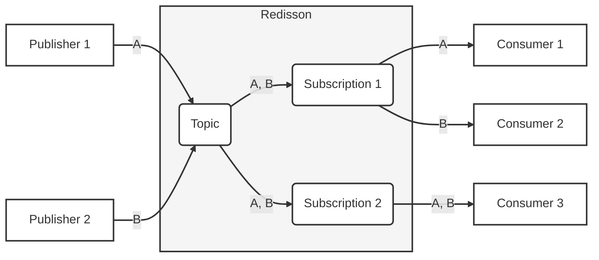
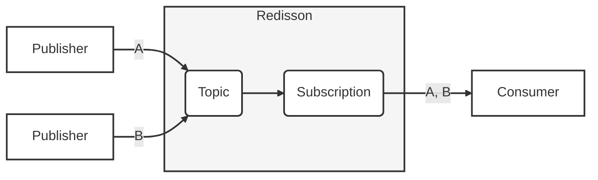
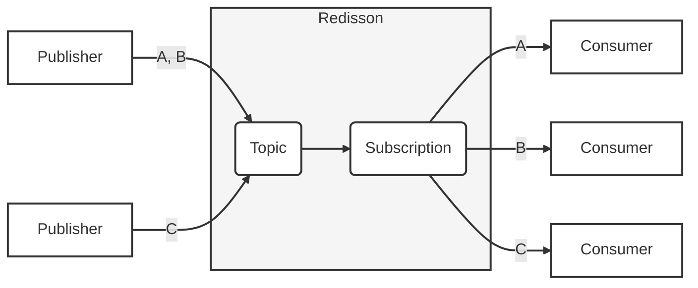
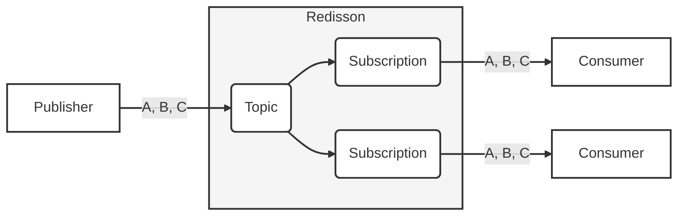

## Reliable Pub/Sub

*This feature is available only in [Redisson PRO](https://redisson.pro/feature-comparison.html) edition.*

The [Reliable PubSub Topic](https://www.javadoc.io/doc/org.redisson/redisson/latest/org/redisson/api/RReliablePubSubTopic.html) object is a specialized publish-subscribe implementation with FIFO messages ordering, built on top of Valkey or Redis that provides robust message processing and advanced topic management features. 

Unlike regular publish/subscribe built into Valkey and Redis, this implementation ensures message delivery, provides acknowledgment mechanisms, message grouping, seek to position and many more. Moreover, Valkey and Redis [persistence with synchronized replication](#durability-and-synchronous-replication) significantly increases Pub/Sub reliability by maintaining multiple consistent copies of data across nodes, ensuring that messages remain available even during node failures or network disruptions.

### Overview

The Reliable PubSub follows a topic-subscription-consumer model where:

- **Topic** stores and manages messages
- **Subscriptions** maintain independent offsets and track message consumption
- **Consumers** process messages within a subscription

The objects above are fully thread-safe.

Message flow example for two publishers send two messages A and B to a common Pub/Sub topic:



#### Pub/Sub patterns

Reliable PubSub allows to implement the patterns below.

**Many-to-one pattern**

Multiple publishers send messages to a single topic, which are then consumed by one subscriber through a single subscription. This pattern is useful for:

- Message aggregation from multiple sources
- Collecting logs or events from distributed systems
- Centralizing data processing from multiple producers



**Many-to-many pattern**

Multiple publishers send messages to a single topic and subscription, but the messages are distributed across multiple consumers. This pattern is ideal for:

- Load balancing across multiple workers
- Parallel processing of messages
- Scaling consumption capacity horizontally



**One-to-many pattern**

A single publisher sends messages to a topic, which then fans out to multiple subscriptions, each feeding a different consumer. This pattern supports:

- Broadcasting messages to multiple independent consumers
- Fan-out scenarios where each consumer needs all messages
- Creating multiple processing pipelines from one source



#### Features

* Message Ordering & Processing

    * **FIFO Message Ordering**: Messages delivered in first-in, first-out order
    * **Bulk Operations**: Process multiple messages in a single operation for improved throughput
    * **Message Grouping**: Sequential processing guarantees for messages with the same group ID


* Consumer Models

    * **Pull and Push**: Flexible message consumption patterns
    * **Subscription Seek**: Per-subscription seek operation for message replay or offset adjustment
    * **Multiple Retention Modes**: Control message retention based on subscription state and processing status

* Topic & Message Limits
  
    * **Topic Size Limit**: Set maximum capacity to prevent unbounded growth
    * **Message Size Limit**: Restrict message size to maintain performance
  
* Message Settings

    * **Message Expiration Timeout**: Automatic removal of messages after a specified duration
    * **Message Visibility Timeout**: Configurable time period during which a message is invisible to other consumers after being retrieved
    * **Message Priority**: Assign importance levels (0-9) to messages for prioritized processing
    * **Message Delay**: Schedule messages for future delivery with configurable delay periods
    * **Message Delivery Limit**: Maximum number of delivery attempts before moving to Dead Letter Topic
    * **Message Headers**: Attach key-value metadata to messages

* Acknowledgment & Delivery

    * **Message Acknowledgment**: Confirm successful processing with explicit acknowledgments
    * **Negative Acknowledgment**: Redeliver failed messages or move rejected messages to Dead Letter Topic
    * **Automatic Redelivery**: Unacknowledged messages are automatically redelivered after visibility timeout
    * **Dead Letter Topic (DLT)**: If a message reached delivery limit or rejected it's transferred to a Dead Letter Topic (DLT). It's a separate instance of Reliable PubSub topic which stores messages for later analysis or reprocessing.

* Reliability & Data Integrity

    * **Durability and Synchronous Replication**: Data redundancy across Valkey or Redis nodes with forced synchronous replication per operation to prevent message loss during node failures.
    * **Message Deduplication**: Prevent duplicate processing by ID or payload hash within a configurable time interval
    * **Atomic Operations**: All PubSub operations are executed atomically. This ensures data consistency and prevents race conditions.
  
* Monitoring & Control

    * **Event Listeners**: Bind listeners to topic events for real-time notifications
    * **Operation Control**: Selectively disable or enable topic operations for maintenance

* Architecture

    * **No Periodic Tasks**: The PubSub operates without relying on periodic background tasks, reducing system overhead and improving reliability.
    * **No Message Broker**: Operates directly on Valkey or Redis without requiring a separate message-broker component and avoiding extra points of failure.


### Configuration

#### Topic

Topic settings can be changed at runtime. All settings are optional. If not set, default values are used.

* `visibility` - Sets the duration for which a message becomes invisible to other consumers after being polled. This prevents multiple consumers from processing the same message simultaneously. Can be overridden in a subscription, when pooling a message or defining push listener. Default value is `30 seconds`.
* `timeToLive` - Sets the time-to-live duration for messages in the topic. Messages will be automatically removed after this duration expires. `0` value means expiration is not applied. Can be overridden when publishing a message. Default value is `0`.
* `maxMessageSize` - Sets the maximum allowed size (in bytes) for a single message. Messages exceeding this size will be rejected. `0` value means size limit is not applied. Default value is `0`.
* `delay` - Sets the delay duration before a message becomes available for consumption after being added. `0` value means delay is not applied. Can be overridden when publishing a message. Default value is `0`.
* `maxSize` - Sets the maximum number of messages that can be stored in the topic. When reached, publish operations may be blocked or return empty result. `0` value means no limit. Default value is `0`.
* `deliveryLimit` - Defines the maximum number of delivery attempts for a message. Once reached, the message may be moved to a dead letter topic if configured, otherwise deleted. Can be overridden in a subscription or when publishing a message. Default value is `10`.
* `retentionMode` - Defines the retention behavior for messages based on subscription state and processing status. Default value is `SUBSCRIPTION_OPTIONAL_RETAIN_ALL`.
    - `SUBSCRIPTION_REQUIRED_DELETE_PROCESSED` - Requires at least one subscriber to store messages. Messages are discarded when all subscriptions have acknowledged, reached redelivery limit, or negatively acknowledged them.
    - `SUBSCRIPTION_REQUIRED_RETAIN_ALL` - Requires at least one subscriber to store messages. Messages are not discarded after processing.
    - `SUBSCRIPTION_OPTIONAL_RETAIN_ALL` - Default mode. Subscribers not required. Messages are always stored regardless of subscription state.

Code example of the reliable pubsub topic config definition:

=== "Sync"
    ```java
    RReliablePubSubTopic<MyObject> topic = redisson.getReliablePubSubTopic("mytopic");

    // or instance with a custom codec defined
    RReliablePubSubTopic<MyObject> topic = redisson.getReliablePubSubTopic("mytopic", new CustomCodec());

    // overrides the previously set configuration
    topic.setConfig(TopicConfig.defaults()
                       .deliveryLimit(4)
                       .visibility(Duration.ofSeconds(60))
                       .timeToLive(Duration.ofHours(24))
                       .maxSize(10000)
                       .retentionMode(RetentionMode.SUBSCRIPTION_REQUIRED_DELETE_PROCESSED));

    // applies the configuration only if no configuration has been set previously
    topic.setConfigIfAbsent(TopicConfig.defaults()
                       .deliveryLimit(4)
                       .visibility(Duration.ofSeconds(60)));
    ```

=== "Async"
    ```java
    RReliablePubSubTopicAsync<MyObject> topic = redisson.getReliablePubSubTopic("mytopic");

    // overrides the previously set configuration
    RFuture<Void> sfr = topic.setConfigAsync(TopicConfig.defaults()
                                           .deliveryLimit(4)
                                           .visibility(Duration.ofSeconds(60)));

    // applies the configuration only if no configuration has been set previously
    RFuture<Boolean> rtsf = topic.setConfigIfAbsentAsync(TopicConfig.defaults()
                                                   .deliveryLimit(4)
                                                   .visibility(Duration.ofSeconds(60)));
    ```

#### Subscription

Subscriptions maintain independent offsets and track message consumption independently of other subscriptions on the same topic. Each subscription can have multiple pull or push consumers that share the workload.

* `name` - Explicitly set subscription name.
* `generatedName` - Auto-generated subscription name.
* `deadLetterTopicName` - Name of the Dead Letter Topic for messages that reached delivery limit or were rejected. Can be removed by setting `null`. Default value is `null`.
* `deliveryLimit` - Maximum number of delivery attempts for a message. Once reached, message may be moved to dead letter topic. Can be overridden when publishing a message. Default value is `10`.
* `visibility` - Duration for which a message becomes invisible after being polled. Can be overridden when pooling a message or defining push listener. Default value is `30 seconds`.
* `position` - Initial position for message consumption. Default is `Position.latest()`.
* `retainAfterAck` - When enabled, messages are retained after acknowledgment.

Code example of subscription creation:

=== "Sync"
    ```java
    RReliablePubSubTopic<MyObject> topic = redisson.getReliablePubSubTopic("mytopic");

    // create subscription with auto-generated name
    Subscription<MyObject> sub1 = topic.createSubscription();

    // create subscription with specific name
    Subscription<MyObject> sub2 = topic.createSubscription(
        SubscriptionConfig.name("my-subscription")
            .deadLetterTopicName("mytopic-dlt")
            .deliveryLimit(5)
            .visibility(Duration.ofMinutes(2))
            .position(Position.earliest()));

    // get existing subscription
    Subscription<MyObject> existing = topic.getSubscription("my-subscription");

    // check if subscription exists
    boolean exists = topic.hasSubscription("my-subscription");

    // get all subscription names
    Set<String> names = topic.getSubscriptions();

    // remove subscription (also removes all consumers)
    boolean removed = topic.removeSubscription("my-subscription");
    ```

=== "Async"
    ```java
    RReliablePubSubTopicAsync<MyObject> topic = redisson.getReliablePubSubTopic("mytopic");

    RFuture<Subscription<MyObject>> subFuture = topic.createSubscriptionAsync(
        SubscriptionConfig.name("my-subscription")
            .deadLetterTopicName("mytopic-dlt")
            .deliveryLimit(5));

    RFuture<Boolean> existsFuture = topic.hasSubscriptionAsync("my-subscription");
    RFuture<Set<String>> namesFuture = topic.getSubscriptionsAsync();
    RFuture<Boolean> removeFuture = topic.removeSubscriptionAsync("my-subscription");
    ```

#### Consumer

Consumers process messages from a subscription. Two types are available:  

   - **Pull Consumer**: On-demand message retrieval with manual control
   - **Push Consumer**: Event-driven message processing via registered listeners

Each consumer allows to specify settings below.

* `name` - Explicitly set consumer name.
* `generatedName` - Auto-generated consumer name.
* `groupIdClaimTimeout` - Timeout for reassigning message group ID ownership to a new consumer.

Code example of consumer creation:

=== "Sync"
    ```java
    Subscription<MyObject> subscription = topic.getSubscription("my-subscription");

    // create pull consumer with auto-generated name
    PullConsumer<MyObject> pullConsumer1 = subscription.createPullConsumer();

    // create pull consumer with specific name and claim timeout
    PullConsumer<MyObject> pullConsumer2 = subscription.createPullConsumer(
        ConsumerConfig.name("my-pull-consumer")
            .groupIdClaimTimeout(Duration.ofMinutes(5)));

    // create push consumer
    PushConsumer<MyObject> pushConsumer = subscription.createPushConsumer(
        ConsumerConfig.name("my-push-consumer"));

    // get all consumer names
    Set<String> consumerNames = subscription.getConsumerNames();

    // check if consumer exists
    boolean exists = subscription.hasConsumer("my-pull-consumer");

    // remove consumer
    boolean removed = subscription.removeConsumer("my-pull-consumer");
    ```

### Publishing Messages

Messages are published to the topic via `publish()` (single message) and `publishMany()` (batch of messages) methods. They become available for consumption upon return from the method.

**Message-Level Settings**

* `payload` - The data to include in the message. **Required setting.**
* `deliveryLimit` - Maximum delivery attempts. Minimum value is `1`. Default uses topic's setting or `10`.
* `timeToLive` - Message expiration timeout. `0` means no expiration. Default uses topic's setting.
* `header` / `headers` - Attach key-value metadata to messages.
* `delay` - Schedule message for future delivery. `0` means immediate delivery.
* `priority` - Priority level from `0` (lowest) to `9` (highest). Default is `0`.
* `groupId` - Group ID for sequential processing by the same consumer.
* `deduplicationById` - Enable deduplication by custom ID for specified interval.
* `deduplicationByHash` - Enable deduplication by payload hash for specified interval.

**Publish Arguments Settings**

* `timeout` - Maximum time to wait when publishing to a full topic with limited size.
* `headersCodec` - Codec for values of message headers serialization.

Code example of messages publishing:

=== "Sync"
    ```java
    RReliablePubSubTopic<MyObject> topic = redisson.getReliablePubSubTopic("mytopic");

    MyObject data = new MyObject();

    // publish single message with full options
    Message<MyObject> msg = topic.publish(PublishArgs.messages(MessageArgs.payload(data)
                                                       .deliveryLimit(10)
                                                       .timeToLive(Duration.ofDays(1))
                                                       .header("type", "order")
                                                       .header("priority", "high")
                                                       .delay(Duration.ofSeconds(30))
                                                       .priority(5)
                                                       .groupId("customer-123")
                                                       .deduplicationById("order-456", Duration.ofHours(1))));

    String id = msg.getId();
    MyObject payload = msg.getPayload();
    Map<String, Object> headers = msg.getHeaders();

    // publish multiple messages in a batch
    List<Message<MyObject>> msgs = topic.publishMany(PublishArgs.messages(
        MessageArgs.payload(data1),
        MessageArgs.payload(data2),
        MessageArgs.payload(data3)));
    ```

=== "Async"
    ```java
    RReliablePubSubTopicAsync<MyObject> topic = redisson.getReliablePubSubTopic("mytopic");

    RFuture<Message<MyObject>> msgFuture = topic.publishAsync(
        PublishArgs.messages(MessageArgs.payload(data)
            .priority(3)
            .delay(Duration.ofMinutes(5))));

    RFuture<List<Message<MyObject>>> batchFuture = topic.publishManyAsync(
        PublishArgs.messages(MessageArgs.payload(data1), MessageArgs.payload(data2)));
    ```

**Publishing to a Bounded Topic**

When the topic has a maximum size (`maxSize > 0`), publish operations will block if the topic is full and `timeout` is defined:

=== "Sync"
	```java
	RReliablePubSubTopic<MyObject> topic = redisson.getReliablePubSubTopic("mytopic");

	// publish with timeout - waits up to 2 minutes for space
	Message<MyObject> msg = topic.publish(PublishArgs.messages(MessageArgs.payload(data))
											   .timeout(Duration.ofMinutes(2)));

	// returns null if timeout elapsed without space becoming available
	```

### Receive messages

#### Pull Consumer

Pull consumers retrieve messages on-demand via `pull()` (single message) and `pullMany()` (batch of messages) methods, providing manual control over message consumption rate and timing.

**Pull Arguments Settings**

* `acknowledgeMode` - How messages are acknowledged after retrieval:
    * `AUTO` - Messages automatically acknowledged after delivery
    * `MANUAL` - Messages must be explicitly acknowledged. Default value.
* `visibility` - Duration message remains invisible after retrieval. Default uses subscription's setting or `30 seconds`.
* `timeout` - Maximum time to wait for messages. `0` means wait indefinitely. Not set by default (non-blocking).
* `count` - Maximum number of messages to retrieve. Default is `1`.
* `headersCodec` - Codec for values of message headers serialization.

**Short Polling (Non-blocking)**

Returns immediately with or without messages:

=== "Sync"
	```java
	Subscription<MyObject> sub = topic.getSubscription("my-subscription");
	PullConsumer<MyObject> consumer = sub.createPullConsumer();

	// poll single message
	Message<MyObject> msg = consumer.pull();

	// poll with custom visibility
	Message<MyObject> msg = consumer.pull(PullArgs.defaults()
											.visibility(Duration.ofSeconds(60))
											.acknowledgeMode(AcknowledgeMode.MANUAL));

	// poll multiple messages
	List<Message<MyObject>> msgs = consumer.pullMany(PullArgs.defaults()
														.count(10)
														.acknowledgeMode(AcknowledgeMode.AUTO));
	```

**Long Polling (Blocking)**

Waits for messages to arrive:

=== "Sync"
	```java
	PullConsumer<MyObject> consumer = subscription.createPullConsumer();

	// wait up to 2 minutes for a message
	Message<MyObject> msg = consumer.pull(PullArgs.defaults()
											.timeout(Duration.ofMinutes(2))
											.visibility(Duration.ofSeconds(30)));

	// wait up to 1 minute for batch of messages
	List<Message<MyObject>> msgs = consumer.pullMany(PullArgs.defaults()
														.timeout(Duration.ofMinutes(1))
														.count(50));
	```

=== "Async"
	```java
	PullConsumer<MyObject> consumer = subscription.createPullConsumer();

	RFuture<Message<MyObject>> msgFuture = consumer.pullAsync(PullArgs.defaults()
                                                                      .timeout(Duration.ofSeconds(30)));

	RFuture<List<Message<MyObject>>> batchFuture = consumer.pullManyAsync(PullArgs.defaults()
																			.count(10));
	```

#### Push Consumer

Push consumers receive a single message per listener's `onMessage()` method invocation.

**MessageListenerArgs Settings**

* `listener` - The message listener to register. **Required.**
* `acknowledgeMode` - How messages are acknowledged after retrieval:
    * `AUTO` - Messages automatically acknowledged after delivery
    * `MANUAL` - Messages must be explicitly acknowledged. Default value.
* `visibility` - Duration message remains invisible. Default uses subscription's setting.
* `headersCodec` - Codec for message headers deserialization.

Code example:

```java
Subscription<MyObject> sub = topic.getSubscription("my-subscription");
PushConsumer<MyObject> consumer = sub.createPushConsumer();

// register listener with manual acknowledgment
consumer.registerListener(MessageListenerArgs.listener((message, acknowledgment) -> {
    try {
        // process message
        MyObject data = message.getPayload();
        String id = message.getId();
        Map<String, Object> headers = message.getHeaders();
        
        // ... business logic ...
        
        // acknowledge successful processing
        acknowledgment.acknowledge(MessageAckArgs.ids(id));
        
    } catch (Exception e) {
        // mark as failed for redelivery
        acknowledgment.negativeAcknowledge(
            MessageNegativeAckArgs.failed(message.getId())
                .delay(Duration.ofSeconds(30)));
    }
})
.acknowledgeMode(AcknowledgeMode.MANUAL)
.visibility(Duration.ofMinutes(1)));

// register listener with auto acknowledgment
consumer.registerListener(MessageListenerArgs.listener((message, acknowledgment) -> {
    // process message - automatically acknowledged after method returns
    processMessage(message.getPayload());
})
.acknowledgeMode(AcknowledgeMode.AUTO));
```

#### Message Grouping

Messages with the same `groupId` are guaranteed to be processed by the same consumer, ensuring sequential processing order for related messages. Order of redelivered messages with the same `groupId` isn't guaranteed.

Code example of message publishing with the same group:

```java
RReliablePubSubTopic<OrderEvent> topic = redisson.getReliablePubSubTopic("orders");

// publish messages with group ID - all events for same customer go to same consumer
topic.publish(PublishArgs.messages(
    MessageArgs.payload(new OrderEvent("order-1", "created"))
        .groupId("group-123")));

topic.publish(PublishArgs.messages(
    MessageArgs.payload(new OrderEvent("order-1", "paid"))
        .groupId("group-123")));

topic.publish(PublishArgs.messages(
    MessageArgs.payload(new OrderEvent("order-1", "shipped"))
        .groupId("group-123")));

// all three messages will be processed by the same consumer in order
```

Configure consumer with `groupIdClaimTimeout` to handle stalled consumers:

```java
PullConsumer<OrderEvent> consumer = subscription.createPullConsumer(
    ConsumerConfig.name("order-processor")
        .groupIdClaimTimeout(Duration.ofMinutes(5)));
```

Message group ownership is reassigned to a new consumer when __both__ conditions are met:

   * The current owner has not received the current pending message for this group id within the timeout period.
   * The current owner has been inactive (no `acknowledge()`, `negativeAcknowledge()`, `pull()`, or push listener invocations) for longer than this timeout.

### Acknowledging Messages

Message acknowledgment is required for messages retrieved with `AcknowledgeMode.MANUAL`.

**Positive Acknowledgment**

Confirms successful processing. The message is deleted from the subscription:

```java
PullConsumer<MyObject> consumer = subscription.createPullConsumer();

Message<MyObject> msg = consumer.pull(PullArgs.defaults()
                                        .acknowledgeMode(AcknowledgeMode.MANUAL));
// process message...

// acknowledge single message
consumer.acknowledge(MessageAckArgs.ids(msg.getId()));

// acknowledge multiple messages
List<Message<MyObject>> msgs = consumer.pullMany(PullArgs.defaults().count(10));
String[] ids = msgs.stream().map(Message::getId).toArray(String[]::new);
consumer.acknowledge(MessageAckArgs.ids(ids));
```

**Negative Acknowledgment**

Explicitly marks messages as failed or rejected:

* `Failed` - Message is redelivered. Optionally specify delay before redelivery.
* `Rejected` - Message is removed and moved to Dead Letter Topic if configured.

```java
PullConsumer<MyObject> consumer = subscription.createPullConsumer();
Message<MyObject> msg = consumer.pull();

try {
    // attempt processing...
} catch (TemporaryException e) {
    // mark as failed with 30 second delay before redelivery
    consumer.negativeAcknowledge(
        MessageNegativeAckArgs.failed(msg.getId())
            .delay(Duration.ofSeconds(30)));
} catch (PermanentException e) {
    // mark as rejected - moves to DLT if configured
    consumer.negativeAcknowledge(
        MessageNegativeAckArgs.rejected(msg.getId()));
}

// batch negative acknowledgment
String[] failedIds = getFailedIds();
consumer.negativeAcknowledge(
    MessageNegativeAckArgs.failed(failedIds)
        .delay(Duration.ofMinutes(1)));

String[] rejectedIds = getRejectedIds();
consumer.negativeAcknowledge(
    MessageNegativeAckArgs.rejected(rejectedIds));
```

### Seek and Replay

Subscriptions maintain an independent offset that tracks the current position in the message stream. The seek operation allows repositioning this offset for message replay from a specific point or skipping ahead to newer messages.

Code usage example:

=== "Sync"
	```java
	Subscription<MyObject> sub = topic.getSubscription("my-subscription");

	// seek to latest (newest) messages
	sub.seek(Position.latest());

	// seek to earliest (oldest) available messages
	sub.seek(Position.earliest());

	// seek to specific message ID (inclusive)
	sub.seek(Position.messageId("0a0c0127ddec23ff3496960478ae3304"));

	// seek to after specific message ID (exclusive)
	sub.seek(Position.messageIdExclusive("0a0c0127ddec23ff3496960478ae3304"));

	// seek to specific timestamp (inclusive)
	sub.seek(Position.timestamp(Instant.parse("2024-01-15T10:00:00Z")));

	// seek to after specific timestamp (exclusive)
	sub.seek(Position.timestampExclusive(Instant.parse("2024-01-15T10:00:00Z")));
	```

=== "Async"
	```java
	RFuture<Void> seekFuture = subscription.seekAsync(Position.earliest());
	```

### Dead Letter Topic (DLT)

A Dead Letter Topic stores messages that cannot be processed or delivered due to errors. Instead of losing or endlessly retrying problematic messages, they are moved to the DLT for later inspection and handling.

Messages are routed to a DLT when:
* Message delivery attempts exceed the maximum delivery limit
* Message was negatively acknowledged with `rejected` status

The DLT is a separate `RReliablePubSubTopic` instance with the same capabilities.

Code example of DLT definition:

=== "Sync"
	```java
	// configure subscription with dead letter topic
	RReliablePubSubTopic<MyObject> topic = redisson.getReliablePubSubTopic("mytopic");

	Subscription<MyObject> sub = topic.createSubscription(
		SubscriptionConfig.name("my-subscription")
			.deadLetterTopicName("mytopic-dlt")
			.deliveryLimit(3));

	// access the dead letter topic
	RReliablePubSubTopic<MyObject> dlt = redisson.getReliablePubSubTopic("mytopic-dlt");

	// list source topics using this as DLT
	Set<String> sources = dlt.getDeadLetterTopicSources();
	// returns: ["mytopic"]

	// process failed messages from DLT
	Subscription<MyObject> dltSub = dlt.createSubscription();
	PullConsumer<MyObject> dltConsumer = dltSub.createPullConsumer();

	List<Message<MyObject>> failedMsgs = dltConsumer.pullMany(PullArgs.defaults().count(100));
	for (Message<MyObject> msg : failedMsgs) {
		// analyze or reprocess failed messages
		analyzeFailedMessage(msg);
		dltConsumer.acknowledge(MessageAckArgs.ids(msg.getId()));
	}
	```

=== "Async"
	```java
	RReliablePubSubTopicAsync<MyObject> dlt = redisson.getReliablePubSubTopic("mytopic-dlt");

	RFuture<Set<String>> sourcesFuture = dlt.getDeadLetterTopicSourcesAsync();
	```

### Management and Monitoring

Messages can be inspected or managed as needed:

* `size()` - Returns total number of messages ready for polling (excludes delayed and unacknowledged)
* `isEmpty()` - Checks if topic is empty
* `clear()` - Removes all messages from the topic
* `contains()` - Checks if message with specified ID exists
* `containsMany()` - Returns count of matching messages
* `get()` - Returns message by ID
* `getAll()` - Returns messages by IDs
* `listAll()` - Returns all messages ready for polling

**Operations Control**

Operations can be disabled or enabled for maintenance:

* `disableOperation(PubSubOperation.PUBLISH)` - Prevents new messages while processing existing ones
* `disableOperation(PubSubOperation.PULL)` - Allows publishing while preventing consumption
* `enableOperation()` - Re-enables a disabled operation

Code example of topic inspection:

```java
RReliablePubSubTopic<MyObject> topic = redisson.getReliablePubSubTopic("mytopic");

// get topic size
int size = topic.size();
boolean empty = topic.isEmpty();

// check for specific messages
boolean exists = topic.contains("msg-id-123");
int count = topic.containsMany("id1", "id2", "id3");

// retrieve messages
Message<MyObject> msg = topic.get("msg-id-123");
List<Message<MyObject>> msgs = topic.getAll("id1", "id2", "id3");

// list all ready messages
List<Message<MyObject>> allMsgs = topic.listAll();

// clear all messages
boolean cleared = topic.clear();

// disable publishing for maintenance
topic.disableOperation(PubSubOperation.PUBLISH);

// re-enable
topic.enableOperation(PubSubOperation.PUBLISH);
```

### Listeners

Redisson provides reliable event listener binding for `RReliablePubSubTopic` objects. Listeners receive messages sent during connection interruptions and failovers.

**Topic-Level Listeners**

| Listener Interface | Event Description |
|-------------------|-------------------|
| `PublishedEventListener` | Messages added to topic |
| `TopicConfigEventListener` | Topic config is set |
| `DisabledOperationEventListener` | Operation switched to disabled state |
| `EnabledOperationEventListener` | Operation switched to enabled state |
| `TopicFullEventListener` | Topic is full |

**Consumer-Level Listeners** (via subscription)

| Listener Interface | Event Description |
|-------------------|-------------------|
| `AcknowledgedEventListener` | Messages acknowledged |
| `NegativelyAcknowledgedEventListener` | Messages negatively acknowledged |
| `PulledEventListener` | Messages polled from subscription |

Code example of listeners usage:

=== "Sync"
	```java
	RReliablePubSubTopic<MyObject> topic = redisson.getReliablePubSubTopic("mytopic");

	// published event listener
	String publishedListenerId = topic.addListener(new PublishedEventListener() {
		@Override
		public void onPublished(List<String> ids) {
			System.out.println("Messages published: " + ids);
		}
	});

	// topic full listener
	String fullListenerId = topic.addListener(new TopicFullEventListener() {
		@Override
		public void onFull(String topicName) {
			System.out.println("Topic is full: " + topicName);
		}
	});

	// config change listener
	String configListenerId = topic.addListener(new TopicConfigEventListener() {
		@Override
		public void onSet(String topicName) {
			System.out.println("Config set for: " + topicName);
		}
	});

	// operation state listeners
	String disabledListenerId = topic.addListener(new DisabledOperationEventListener() {
		@Override
		public void onDisabled(String topicName, PubSubOperation operation) {
			System.out.println("Operation disabled: " + operation);
		}
	});

	String enabledListenerId = topic.addListener(new EnabledOperationEventListener() {
		@Override
		public void onEnabled(String topicName, PubSubOperation operation) {
			System.out.println("Operation enabled: " + operation);
		}
	});

	// remove listeners
	topic.removeListener(publishedListenerId);
	topic.removeListener(fullListenerId);
	```

=== "Async"
	```java
	RReliablePubSubTopicAsync<MyObject> topic = redisson.getReliablePubSubTopic("mytopic");

	RFuture<String> listenerFuture = topic.addListenerAsync(new PublishedEventListener() {
		@Override
		public void onPublished(List<String> ids) {
			// handle published messages
		}
	});

	RFuture<Void> removeFuture = topic.removeListenerAsync(listenerId);
	```

### Statistics

Reliable PubSub provides comprehensive statistics at topic, subscription, and consumer levels.

#### Topic

Topic statistics provide an overview of the topic's state and activity.

| TopicStatistics Method        | Description                                      |
| ----------------------------- | ------------------------------------------------ |
| `getTopicName()`              | Name of the topic                                |
| `getDelayedMessagesCount()`   | Number of messages scheduled for future delivery |
| `getSubscriptionsCount()`     | Number of subscriptions                          |
| `getPublishedMessagesCount()` | Total number of messages published to the topic  |

```java
RReliablePubSubTopic<MyObject> topic = redisson.getReliablePubSubTopic("mytopic");

TopicStatistics stats = topic.getStatistics();

String topicName = stats.getTopicName();
long delayedCount = stats.getDelayedMessagesCount();
long subscriptionsCount = stats.getSubscriptionsCount();
long publishedCount = stats.getPublishedMessagesCount();
```

#### Subscription

Subscription statistics track message processing progress and delivery patterns.

| SubscriptionStatistics Method              | Description                                               |
| ------------------------------------------ | --------------------------------------------------------- |
| `getSubscriptionName()`                    | Name of the subscription                                  |
| `getConsumersCount()`                      | Number of active consumers                                |
| `getUnacknowledgedMessagesCount()`         | Messages currently being processed (not yet acknowledged) |
| `getAcknowledgedMessagesCount()`           | Total messages successfully processed                     |
| `getNegativelyAcknowledgedMessagesCount()` | Total messages marked as failed or rejected               |
| `getRedeliveryAttemptsCount()`             | Number of message redelivery attempts                     |
| `getDeadLetteredMessagesCount()`           | Messages moved to the Dead Letter Topic                   |

```java
Subscription<MyObject> sub = topic.getSubscription("my-subscription");

SubscriptionStatistics stats = sub.getStatistics();

String subscriptionName = stats.getSubscriptionName();
long consumersCount = stats.getConsumersCount();
long redeliveryAttempts = stats.getRedeliveryAttemptsCount();
long unackedCount = stats.getUnacknowledgedMessagesCount();
long ackedCount = stats.getAcknowledgedMessagesCount();
long nackedCount = stats.getNegativelyAcknowledgedMessagesCount();
long deadLetteredCount = stats.getDeadLetteredMessagesCount();
```

#### Consumer

Consumer statistics provide per-consumer metrics for workload distribution analysis.

| ConsumerStatistics Method                  | Description                                                  |
| ------------------------------------------ | ------------------------------------------------------------ |
| `getConsumerName()`                        | Name of the consumer                                         |
| `getUnacknowledgedMessagesCount()`         | Messages retrieved but not yet acknowledged by this consumer |
| `getAcknowledgedMessagesCount()`           | Total messages successfully acknowledged by this consumer    |
| `getNegativelyAcknowledgedMessagesCount()` | Total messages negatively acknowledged by this consumer      |

```java
PullConsumer<MyObject> consumer = subscription.createPullConsumer();

ConsumerStatistics stats = consumer.getStatistics();

String consumerName = stats.getConsumerName();
long unackedCount = stats.getUnacknowledgedMessagesCount();
long ackedCount = stats.getAcknowledgedMessagesCount();
long nackedCount = stats.getNegativelyAcknowledgedMessagesCount();
```

**Async**
```java
RFuture<TopicStatistics> topicStatsFuture = topic.getStatisticsAsync();
RFuture<SubscriptionStatistics> subStatsFuture = subscription.getStatisticsAsync();
RFuture<ConsumerStatistics> consumerStatsFuture = consumer.getStatisticsAsync();
```

### Durability and Synchronous Replication

The synchronization mechanism allows PubSub modification operations to be propagated to replica nodes in a controlled manner, ensuring data consistency across Valkey or Redis cluster. Additionally, Valkey and Redis persistence options, such as append-only files (AOF), and RDB snapshots, significantly increase PubSub reliability by preventing data loss during server restarts or failures, allowing for recovery of queued messages that would otherwise be lost when using only in-memory storage. 

Valkey and Redis use asynchronous replication. Reliable PubSub introduces synchronous replication modes per operation to address the limitations of asynchronous replication. This capability with proper configuration of Valkey and Redis persistence transforms storage from a purely volatile memory store into a more robust message broker suitable for applications where message delivery guarantees are critical. This is particularly important for mission-critical applications where data loss is unacceptable.

Each PubSub modification operation can be configured with specific synchronization parameters:

- `syncMode` - Sets the synchronization mode to be used for current operation. Default value is `AUTO`.

	 Three synchronization strategies are available:
	
    - `AUTO` - Ensures data durability by blocking until write operations are confirmed as persisted to the memory  and the Append-Only File (AOF) on the primary Valkey or Redis node and replicas if the AOF persistence feature is enabled. If AOF persistence is unavailable, falls back to blocking until replica nodes acknowledge that write operations have been applied to memory. If neither durability mechanism is available, proceeds without synchronization guarantees.
	- `ACK` - Ensures data durability by blocking until replica nodes acknowledge that write operations have been applied to memory.
	- `ACK_AOF` - Ensures data durability by blocking until write operations are confirmed as persisted to the memory and the Append-Only File (AOF) on the primary Valkey or Redis node and replicas. Requires Redis 7.2.0+ or any Valkey version.
	
- `syncFailureMode` - Sets the behavior when synchronization with replica nodes fails. Default value is `LOG_WARNING`. 

	Two failure handling modes are available: 
	
    - `THROW_EXCEPTION` - Throw an exception to the caller. This mode is useful in scenarios where synchronization failures should be immediately visible and handled by the application code.
    - `LOG_WARNING` - Log a warning message but continue execution. This mode is suitable for non-critical synchronization operations where the application can continue functioning despite synchronization issues.

- `syncTimeout` - Sets the timeout duration for synchronization of the current operation. Defines how long the caller will wait for acknowledgment from replica nodes. Default value is `1 second`.

Code examples of synchronization parameters usage:
=== "Sync"
    ```java

    RReliablePubSubTopic<MyObject> topic = redisson.getReliablePubSubTopic("test");

    // Publishing
    topic.publish(PublishArgs.messages(MessageArgs.payload(data))
                                                  .syncMode(SyncMode.ACK_AOF)
                                                  .syncTimeout(Duration.ofSeconds(15))
                                                  .syncFailureMode(SyncFailureMode.LOG_WARNING));

    // Get subscription and consumer for pull/acknowledge operations
    Subscription<MyObject> sub = topic.getSubscription("my-subscription");
    PullConsumer<MyObject> consumer = sub.createPullConsumer();

    // Pulling
    Message<MyObject> msg = consumer.pull(PullArgs.defaults()
                                                  .syncMode(SyncMode.ACK)
                                                  .syncTimeout(Duration.ofSeconds(10))
                                                  .syncFailureMode(SyncFailureMode.THROW_EXCEPTION));

    // Acknowledge
    consumer.acknowledge(MessageAckArgs.ids(msg.getId())
                                       .syncMode(SyncMode.AUTO)
                                       .syncTimeout(Duration.ofSeconds(20)));

    // Negative acknowledge
    consumer.negativeAcknowledge(MessageNegativeAckArgs.rejected(msg.getId())
                                                       .syncMode(SyncMode.ACK)
                                                       .syncTimeout(Duration.ofSeconds(15)));    
    ```
=== "Async"
    ```java
    RReliableQueue<MyObject> rq = redisson.getReliableQueue("test");

    RFuture<Message<MyObject>> arf = rq.addAsync(QueueAddArgs.messages(MessageArgs.payload(data))
                                                        .syncMode(SyncMode.ACK_AOF)
                                                        .syncTimeout(Duration.ofSeconds(15))
                                                        .syncFailureMode(SyncFailureMode.LOG_WARNING));
    
    RFuture<Message<MyObject>> prf = rq.pollAsync(QueuePollArgs.defaults()
                                                        .syncMode(SyncMode.ACK)
                                                        .syncTimeout(Duration.ofSeconds(10))
                                                        .syncFailureMode(SyncFailureMode.THROW_EXCEPTION));
    
    RFuture<Void> ack = rq.acknowledgeAsync(QueueAckArgs.ids(msg.getId())
                                                .syncMode(SyncMode.AUTO)
                                                .syncTimeout(Duration.ofSeconds(20)));
    
    RFuture<Void> nack = rq.negativeAcknowledgeAsync(QueueNegativeAckArgs.rejected(msg.getId())
                                                        .syncMode(SyncMode.ACK)
                                                        .syncTimeout(Duration.ofSeconds(15)));
    
    ```
=== "Reactive"
    ```java
    RedissonReactiveClient redisson = redissonClient.reactive();
    RReliableQueueReactive<MyObject> rq = redisson.getReliableQueue("test");
    ```

    Mono<Message<MyObject>> arf = rq.add(QueueAddArgs.messages(MessageArgs.payload(data))
                                                .syncMode(SyncMode.ACK_AOF)
                                                .syncTimeout(Duration.ofSeconds(15))
                                                .syncFailureMode(SyncFailureMode.LOG_WARNING));
    
    Mono<Message<MyObject>> prf = rq.poll(QueuePollArgs.defaults()
                                            .syncMode(SyncMode.ACK)
                                            .syncTimeout(Duration.ofSeconds(10))
                                            .syncFailureMode(SyncFailureMode.THROW_EXCEPTION));
    
    Mono<Void> ack = rq.acknowledge(QueueAckArgs.ids(msg.getId())
                                        .syncMode(SyncMode.AUTO)
                                        .syncTimeout(Duration.ofSeconds(20)));
    
    Mono<Void> nack =     rq.negativeAcknowledge(QueueNegativeAckArgs.rejected(msg.getId())
                                                        .syncMode(SyncMode.ACK)
                                                        .syncTimeout(Duration.ofSeconds(15)));
    
    ```
=== "RxJava3"
    ```java
    RedissonRxClient redisson = redissonClient.rxJava();
    RReliableQueueRx<MyObject> rq = redisson.getReliableQueue("test");

    Maybe<Message<MyObject>> arf =     rq.add(QueueAddArgs.messages(MessageArgs.payload(data))
                                                .syncMode(SyncMode.ACK_AOF)
                                                .syncTimeout(Duration.ofSeconds(15))
                                                .syncFailureMode(SyncFailureMode.LOG_WARNING));
    
    Maybe<Message<MyObject>> prf = rq.poll(QueuePollArgs.defaults()
                                            .syncMode(SyncMode.ACK)
                                            .syncTimeout(Duration.ofSeconds(10))
                                            .syncFailureMode(SyncFailureMode.THROW_EXCEPTION));
    
    Completable ack = rq.acknowledge(QueueAckArgs.ids(msg.getId())
                                        .syncMode(SyncMode.AUTO)
                                        .syncTimeout(Duration.ofSeconds(20)));
    
    Completable nack =     rq.negativeAcknowledge(QueueNegativeAckArgs.rejected(msg.getId())
                                                    .syncMode(SyncMode.ACK)
                                                    .syncTimeout(Duration.ofSeconds(15)));
    
    ```

